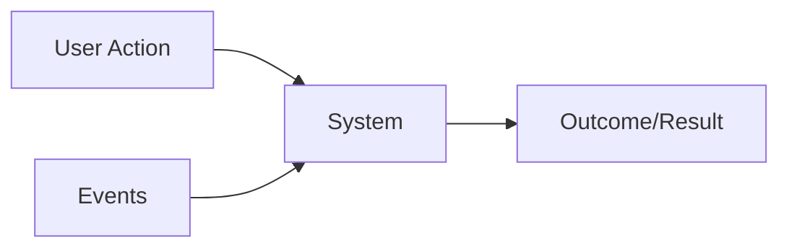

# Requirements

- `Requirements` is a formal description of how the system should behave
- It's important to raise the right requirements because changes in large systems are expensive (engineers, contracts, reputation, brand)
- Requirements are the `architectural drivers`

## Raising requirements

- The client (who demands the feature) usually do not know what they need (they requirement), but they know `what they want to solve`
- What problem is being solved here?
  - E.g., "Allow people to join drivers on a route, who are willing to take passengers for a fee"
-`Make the right questions` to solve the problem!

## Classification

### Feature Set (`Functional Requirements`)

- Requirements that define the target feature (`must do`)
- Results may be triggered by either user actions or events
- Functional requirements DO NOT influence on the architecture, since a feature can be implemented using any kind of architecture (just it may not be viable)

- **Examples**
  - User must have access to the e-commerce platform
  - User must be able to search an item

### Quality attributes (`Non-Functional Requirements`)

- Quality measures that brings value to the product (`must have`)
- Non-functional requirements DO influence on the architecture

- **Examples**
  - Minimum latency
  - Scalability
  - Flexibility

### System Constraints

- Limitations and boundaries
- System constraints requirements DO influence on the architecture

- **Examples**
  - Time constraints, strict deadlines
  - Financial constraints, limited budget
  - Staffing constraints, small number of available engineers

### Extended Requirements

- Browsing data has to be saved for future analytics
