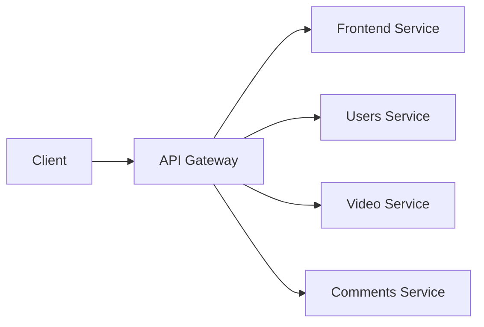

# API Gateway

- A API Gateway is a `single point access` for front-end applications or other internal subsystems
  - Composes all the APIs of the internal services into a single API (`API composition`)
- It `proxies requests` to the appropriate internal service

## Features

1. `API composition`
1. `Request routing`
    - The gateway aggregates information from multiple internal endpoints
    - This concept is similar to BFF (Back For Front)
1. `Authentication & Authorization`
1. `Rate limits`
    - Request throttling
    - To block DoS attacks
1. `Caching`
    - Caches static content
    - Caches stateless responses
1. `Monitoring and Alerting`
    - The monitoring of the API gateway may point out issues on the overall system working
    - E.g., sudden throughput drop, high latency, etc
1. `Protocol Translation`
    - E.g., Convert REST+JSON to gRPC+protobuf
    - E.g., Convert SOAP+XML to REST+JSON
1. `Versioning`
    - According to a header, may redirect the request to different versions of the internal API

## Anti-Pattern

1. Should NOT contain business logic
1. Should NOT be a single point of failure (have multiple instances behind a LB)
1. Changes to the API Gateway must be very cautious (adopt blue/green or similar deployment strategies)

## Implementations

- Open Source
  - **Zuul**: created by netflix
- Cloud based
  - **AWS API Gateway**
  - **GCP API Gateway**
  - **Azure API Management**
