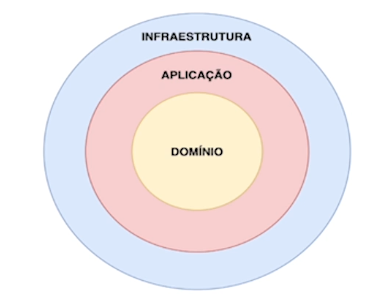
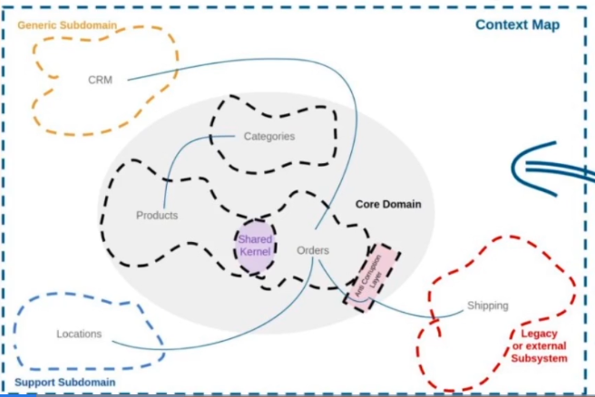

# Domain Driven Design

- Model the application thinking first about the `business rules`
- Differently from Clean Architecture, the Domain layer can call the Infrastructure layer

## Ubiquitous Language

- A universal language that developers and business experts understand
- It's a mix between the `business experts jargon` and the `technical experts jargon`

## Bounded Context

- A context to which the definitions of the system apply
- A `Context Map` is a visual representation of the system and its dependencies

- A solution to separate the contexts is to divide them by package or as a microservice

## Building Blocks

- Entity
- Value Object
- Repository
- Factory
- Service

## Business Invariant

- A validation relative to the business rule
- E.g., a student cannot contain more than 2 phone numbers

## Aggregate Root

- An `entity` (e.g., a student) that aggregates various other `value objects` (e.g., email, phone)
- All the VOs must be manipulated by means of the `aggregate root`. This guarantee the validation and consistency of the data
- The aggregate root can be in the `domain` layer or `infra` layer
