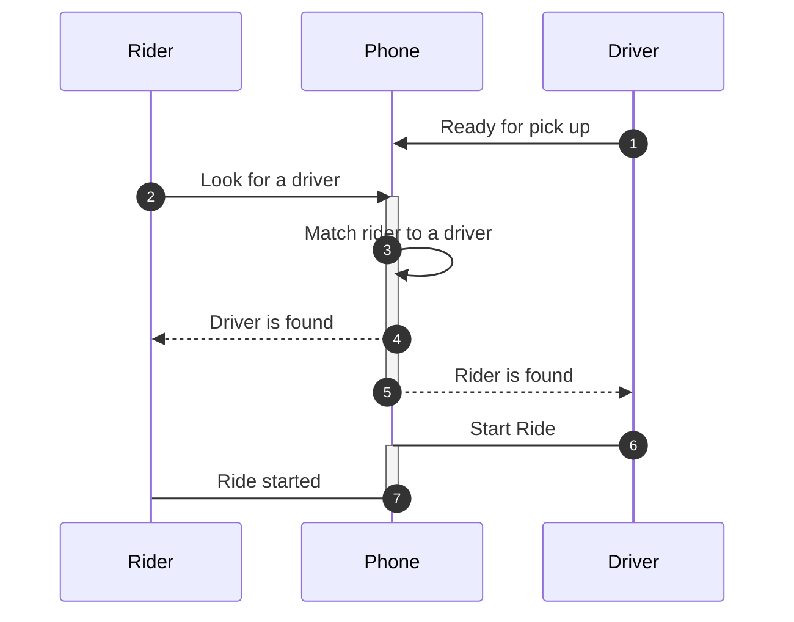
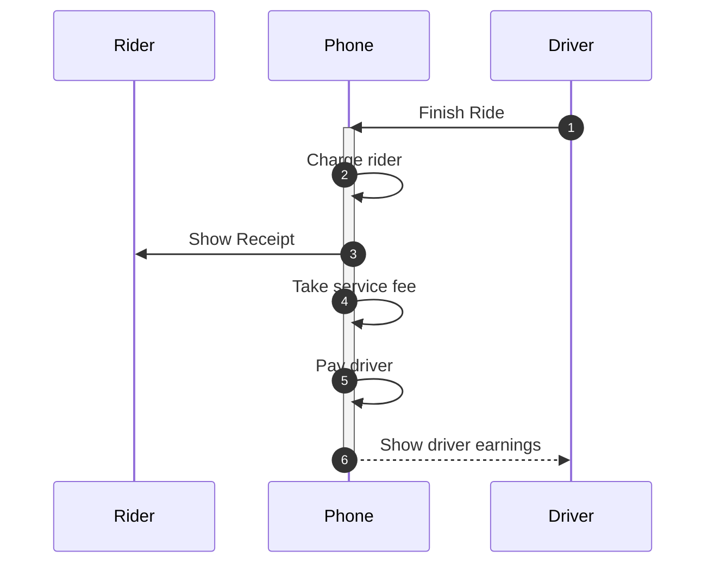

# Use Cases & User flows

- It's a methodology for gathering requirements
- Explicits the situations/scenarios in which the system would be used
- A `user flow` is a detailed as a `sequence diagram` (part of the UML standard)

1. Identify the `actors/users` of the system
1. Identify and describe all the `possible use cases`
1. Expand each use case in form of `user flows`
1. Detail the `actions` and `data` of each event

- Example: "allow people to join drivers on a route, who are willing to take passengers for a fee"
  - Actors
    - Driver and Rider
  - Use Cases
    - Rider first time registration
    - Driver registration
    - Rider login
    - Driver login
    - Successful match and ride
    - Unsuccessful ride
  - User flow ("Successful match and ride" expanded)

