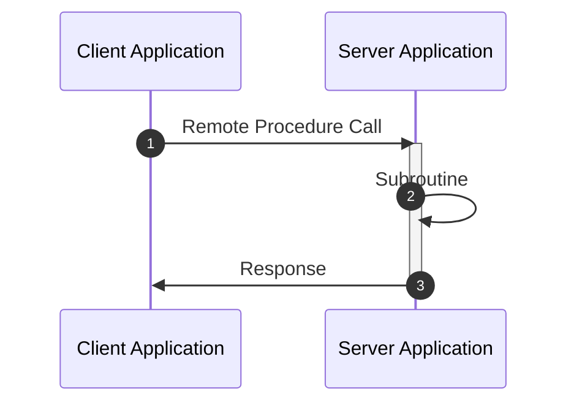

# API Design

## Best practices

1. `Encapsulation`: the API must be completely decoupled from the internal design so that the internals can be changed without prejudice and the client does no need to know the internal workings
2. `Ease of use`:
3. `Idempotency`:
4. `Pagination`:
5. `Async operations`: the client receives a response immediately (just an ack) and the heavy processing is done asynchronously
6. `Versioning`

## RPC (Remote Procedure Call)

- It's be ability of an application to execute a subroutine in a remote server
- From the developer experience, it looks just like a normal local method call (`location transparency`)
- RPC revolves around methods. While REST revolves around resources



- The API contract is declared using a **Interface Description Language** (IDL)
- Once the contract is defined, the `RPC Code Generation Tool` (part of the RPC framework) can be used to generate code for the server application and for the client application
  - The auto-generated code implementation for the client is called `Client Stub`
    - The client stub serializes/marshalls the data, initiates the connection and send
    - The client stub receives and deserializes the response once ready
  - The auto-generated code implementation for the server is called `Server Stub`
    - The server stub listens to the client app and receive the data. Data deserialized/unmarshalled and the real method is invoked
    - The server stub sends back to the client the response
  - The auto-generated object types (used in the interface) are called `Data Transfer Objects` (DTO)

```rpc
debitAccount(UserInfo userInfo, int32 amount) -> Response

UserInfo {
  String name, lastname;
  String creditCardNumber;
  int32 securityCode;
}

Response {
  bool success;
  String errorMessage;
}
```

- **RPC Frameworks**
  - `gRPC`
    - Created by Google in 2015
    - Uses http/2
    - Uses protobuf as IDL
  - `Apache Thrift1`
    - Created by Facebook
    - Uses its own IDL
  - `Java Remote Method Invocation` (RMI)
    - Communications between JVMs
    - Uses Java as IDL

## REST (Representational State Transfer)

- Set of architectural constraints and best practices for defining APIs for the web
- REST revolves around resources. While RPC revolves around methods

- `Hypermedia as the Engine of the Application State` (HATEOAS)
  - It's a way for the client to know what other methods/endpoints are available for related resources

- Quality attributes
    1. `Statelessness`
    1. `Cacheability`

- HTTP methods mapping
  - `GET`: get a resource or list resources in a collection
  - `POST`: create a new resource
  - `UPDATE`: update an existing resource
  - `DELETE`: delete an existing resource
