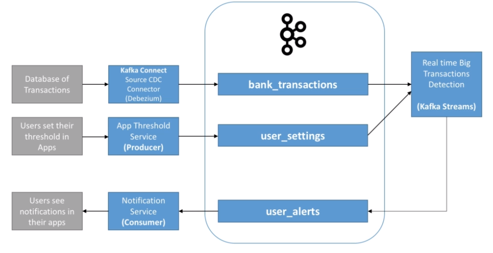

# Change Data Capture (CDC)

- Take events happening in a database and publishes them as an event in an event broker
- CDC implementation: `Debezium` Kafka Connector

## Event sourcing

- All the changes are captured in a `event object` (for example, a kafka topic)
- These objects must be stored in another database in the exact order that they were applied
