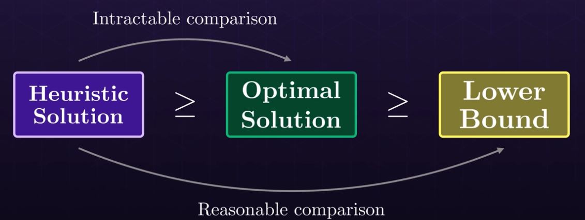

# Traveling Salesman (TSP)

- Shortest route to visit all the nodes in a given graph
- The brute force solution is $O(n!)$
- The solution can be refined with heuristic to $O(2^n)$

## Assumptions

1. Symmetric TSP
    - The distance from `A` to `B` is the same as the distance from `B` to `A`
1. Triangle Inequality
    - A direct path between two nodes is always the shortest path

## Benchmarking

$$\alpha = \frac{heuristic\ solution}{optimal\ solution}$$

Where:

- $\alpha$ is the approximation ration (how good the solution is) - the closer to 1 the better

As the optimal solution is sometimes impossible to be defined as benchmark it is used the `lower bound` solution

### Minimum Spanning Tree (MST)

- It's the minimum distance to visit all nodes starting from a given node
- It's used as the reasonable `lower bound` for benchmarking purposes

- It's solved using the **prims algorithms**
  - Similar to dijkstra (implemented with a priority queue) and it's also greedy
  - However, it picks at each iteration the local minimum distance (instead of the distance to the start) - simpler!

- To refine the lower bound even further the `1-tree lower bound` technique is applied
    1. Remove any vertex from and find the MST
    2. Connect this vertex to the MST with the two closer vertexes

## Heuristics

### Nearest Neighbor (NN) Heuristic

- As the next target node, pick the nearest one
$$\alpha = 1.25$$

### Greedy Heuristic

- Connect the nodes with shorter edges from the whole graph
- Do not connect nodes if it forms a cycle (if either of the nodes is already connected to two other nodes)

$$\alpha = 1.17$$
