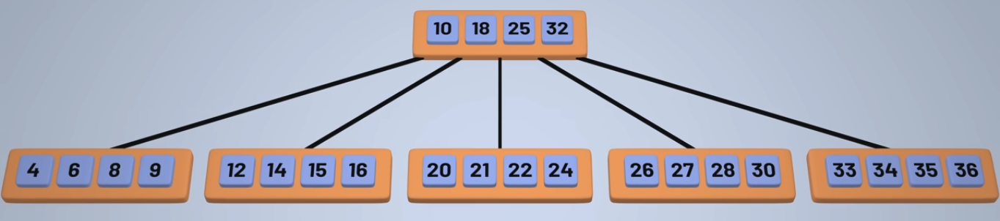

# B-tree

- Similar to a BST but can contains several children one for each range of data in the node value
- This makes the final tree more shallow

- Each node has a maximum number of keys (vals) `k`
  - For instance in Tries, the maximum number of keys is 26 (letters of the alphabet)

## Adding elements

- When the keys in a node exceeds k, it is then split in three parts (`left` + `middle` + `right`), where middle is the middle value of the array
- The middle part will be pushed to the node above and the left and right will be created as new nodes
