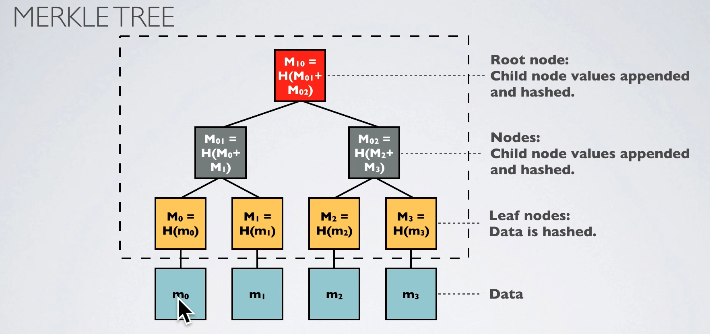

# Merkle Tree

> A hash tree or Merkle tree is a tree structure where each `leaf node` is a hash of a block of data, and each `non-leaf` node is a hash of its child nodes.

- It uses a `hash-based tree structures` to store the children (just like in a trie)

- Only the leaf nodes actually contain the data, the rest is just hashes of data or hashes of hashes

## Usage

- Using a Merkle tree provides integrity and validity of your data using a small amount of data that a trusted authority has to maintain
- It's used to verify that a message is actually legit. For that you need to get hash values for all nodes until the root node $O(log(n))$
- Merkle tree is used in `blockchain` to efficiently verify the consistency and integrity of large datasets.
