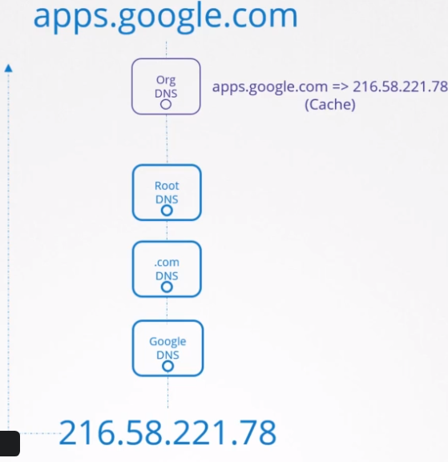

# DNS (Domain Name System)

- DNS servers are crucial for the functioning of the internet as they facilitate the resolution of `domain names` to `IP addresses`.
- A UDP package is sent over `UDP` (unencrypted) to the `DNS Resolver` on port `53`
- `ICANN`: nonprofit organization that oversees the use of internet domains
  - WHOIS info: <https://lookup.icann.org/> (includes registrar and nameserver config)
- **Terminology**

  - `Domain Name System` (DNS) translates hostnames
  - `Domain Registrar`: GoDaddy, Route53, etc
  - `DNS Record Types`: A, AAAA, CNAME, NS, ...
  - `Zone File`: Contains all the DNS records
  - `Name Server`: Servers that resolve the DNS query (authoritative or non-authoritative)

## Domain Registrar

- `Domain Registrar` is a company who can provide internet domain names
- Examples:
  - Cloudfare (recommended)
  - Namecheap (recommended)
  - GoDaddy
  - Wix
  - AWS Route53
  - Registo BR (*.br only)
- They verify if the domain is available and allow you to purchase it
- Once the domain is registered, you are the `legal owner` of the domain name

## DNS Resolver (DNS Server)

- Also known as `authoritative DNS server` or `nameserver`
- Also known as `recursive DNS resolver`
- A **DNS server** is any server that implements the DNS protocol
- It manages dns tables centrally. Then all hosts must look up that server.
- The host must configure the file `/etc/resolv.conf` with the dns server URL to fetch from
- Add dns entries locally to `/etc/hosts`

```conf
search mycompany.com prod.mycompany.com # append domain names to the requests
nameserver 192.168.1.100 # ip of a dns server
nameserver 8.8.8.8 # another dns server (google)
```

- `DNS Lookup Order`: 1st /etc/hosts, 2nd DNS server.
  - The order can be modified at `/etc/nsswitch.conf` (line with hosts entry)

- **Authoritative DNS Server**

  - A DNS Server where the customer (you) can modify the DNS records
  - For instance, Route53 is both an `authoritative DNS server` and a `domain registrar`

## DNS Record Types

- **A**
  - hostname to IPv4
  - webserver 192.168.1.1
- **AAAA**
  - hostname to IPv6
  - webserver 2804:14d:1:0:181:213:132:4
- **CNAME**
  - hostname to hostname (aliases)
  - E.g, food.web-server eat.web-server,hungry.web-server
- **NS**
  - The NS records are pointers to the `authoritative name servers` for a particular domain or subdomain.
  - When using a Registrar that has DNS server support, this config is usually automatically configured
  - You can also use a registrar and configure a different NS (custom name server)
  - E.g., .com, .net

Others: `CAA`, `DS`, `MX`, `NAPTR`, `PTR`, `SOA`, `TXT`, `SPF`, `SRV`

## Domain Names & Levels

- **Root**: .
- **Top Level Domain** (TLD)
  - E.g., .com, .net, .gov
- **Second Level Domain** (SLD)
  - Also known as apex domain
  - Configured with A, ALIAS or ANAME records
  - E.g., amazon.com, google.com
- **Subdomain**
  - Configured with CNMAE record
  - E.g, api.amazon.com.


- Resolving steps
  1. Hit the local dns server
  1. Hit the root dns server
  1. Hit the .com dns server
  1. Hit the google dns server: serve you with the IP of the apps subdomain



## DNSSEC (DNS Security Extensions)

- Protect your domain from threats
  - DNS cache poisoning attacks
  - DNS spoofing

## DNS Server Types

### Plain DNS

- Plain `UDP/53` connection
- Public Servers

  - **Google**
    - `8.8.8.8` & `8.8.4.4` (unfiltered)

  - **Cloudflare**
    - `1.1.1.1` & `1.0.0.1` (unfiltered)
    - `1.1.1.2` e `1.0.0.2` (blocks malware)

  - **AdGuard**
    - <https://adguard-dns.io/en/public-dns.html>
    - `94.140.14.14` & `94.140.15.15` (block ads and trackers )

### DNS over HTTPS (DoH)

- Establishes a TCP connection (instead of UDP) using TLS (encrypted) on port `443`
- Avoids DNS leak
- Improvement: Oblivious DNS over HTTPS (ODoH)

- Public Servers
  - **AdGuard**
    - <https://dns.adguard-dns.com/dns-query>

### DNS over TLS (DoT)

- Plain TCP connection on port `853`
- Public Servers
  - **AdGuard**
    - <tls://dns.adguard-dns.com>
