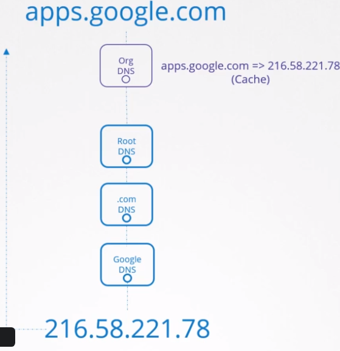

# Domains

## Domain Names & Levels

- **Root**: .

- **Top Level Domain** (TLD)
  - E.g., .com, .net, .gov

- **Second Level Domain** (SLD)
  - Also known as `apex domain`
  - Configured with A, ALIAS or ANAME records
  - E.g., amazon.com, google.com

- **Subdomain**
  - Configured with CNMAE record
  - E.g, api.amazon.com.

- Resolving steps
  1. Hit the local dns server
  1. Hit the root dns server
  1. Hit the .com dns server
  1. Hit the google dns server: serve you with the IP of the apps subdomain

## Fully Qualified Domain Name (FQDN)

- The fully qualified domain name (FQDN), such as `www.example.com`
- You can use wildcards to match all the subdomains in a domain. E.g., `*.example.com`
