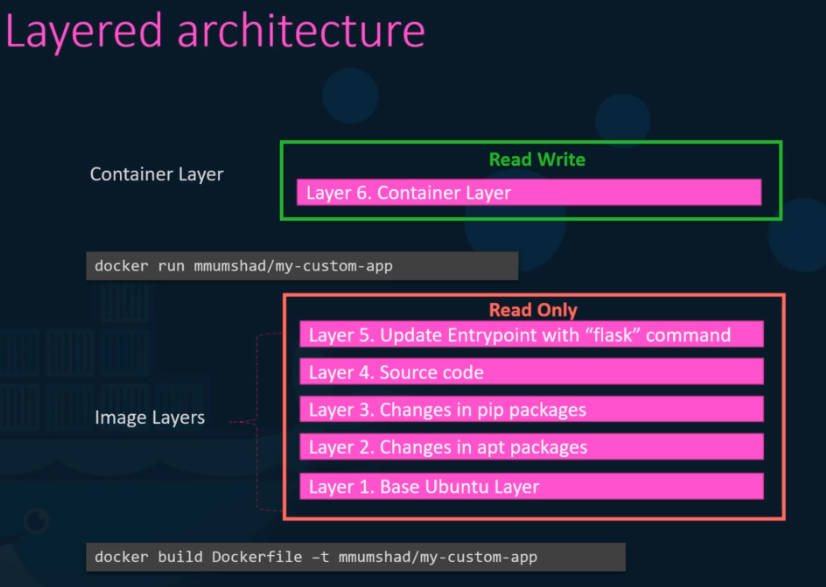

# OCI Image Format Specification

- Image standard specification
- Tool to manage OCIs: `runc` <https://github.com/opencontainers/runc>

## Layered architecture

- **Container Layer**: Read-Write layer that a system is running
- **Image Layer**: Read-Only layer pre-built

- If a file from the image layer is modified, it's actually copied and modified (`copy-on-write`)
- The Container Layer is lost after the pod has been terminated
- The container image is a set of binary layers (similar to git commits, but to binary files)

## Overlay2

- It's the `union filesystem` mounted from the image into the container
- It unifies all the layers from the image
