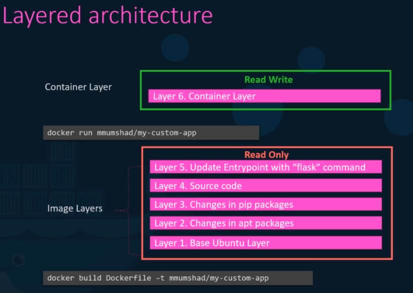

# Layered architecture

- **Container Layer**: Read-Write layer that a system is running
- **Image Layer**: Read-Only layer pre-built

- If a file from the image layer is modified, it's actually copied and modified (`copy-on-write`)
- The Container Layer is lost after the pod has been terminated
