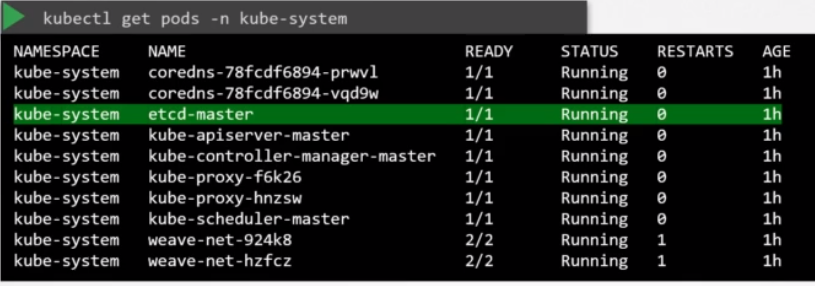

# ETCD on Kubernetes

- It's a highly available `key-value` `distributed` database
- Stores the `desired state`
- Maintain information about the worker nodes
  - E.g., what containers were deployed at what time
- Stores informations regarding the cluster such as
  - Nodes, pods, configs, secrets, accounts, roles, binding, others
- Every information got from kubectl comes from etcd
- You must specify the path to certificate files so that etcdctl can authenticate to `etcd API Server`

## Setup

### From scratch

- `etcd.service` must be configured manually if running a kubernetes cluster from scratch

```shell
wget "https://github.com/etcd-io/etcd/releases/download/v3.5.0/etcd-v3.5.0-linux-amd64.tar.gz"
tar -xzvf "etcd-v3.5.0-linux-amd64.tar.gz"
./etcd
```

```conf
ExecStart=/usr/local/bin/etcd \\
  --name=${ETCD_NAME} \\
  --cert-file=/etc/etcd/kubernetes.pem \\
  --key-file=/etc/etcd/kubernetes-key.pem \\
  --trusted-ca-file=/etc/etcd/ca.pem \\
  --peer-cert-file=/etc/etcd/kubernetes.pem \\
  --peer-key-file=/etc/etcd/kubernetes-key.pem \\
  --peer-trusted-ca-file=/etc/etcd/ca.pem \\
  --peer-client-cert-auth \\
  --client-cert-auth \\
  --initial-advertise-peer-urls=https://${INTERNAL_IP}:2380 \\
  --listen-peer-urls=https://${INTERNAL_IP}:2380 \\
  --listen-client-urls=https://${INTERNAL_IP}:2379,https://127.0.0.1:2379 \\
  --advertise-client-urls=https://${INTERNAL_IP}:2379 \\
  --initial-cluster-token=etcd-cluster-0 \\
  --initial-cluster controller-0=https://${CONTROLLER0_IP}:2380,controller-1=https://${CONTROLLER1_IP}:2380 \\
  --initial-cluster-state new \\
  --data-dir=/var/lib/etcd
```

### Via kubeadm

- `kubeadm` install the service automatically as a pod `etcd-master` inside of the `kube-system` namespace
- The pod is deployed on the master node



```shell
# Get all keys (root /)
kubectl -n "kube-system" exec "etcd-master" -- etcdctl get "/" --prefix -keys-only
```

- The certificate files are available at the `etcd-master` pod (kube-system namespace)
  - cacert: `/etc/kubernetes/pki/etcd/ca.crt`
  - cert: `/etc/kubernetes/pki/etcd/server.crt`
  - key: `/etc/kubernetes/pki/etcd/server.key`

```shell
kubectl -n "kube-system" exec "etcd-master" -- sh -c \
  "ETCDCTL_API=3 etcdctl get / \
    --prefix \
    --keys-only \
    --limit=10 \
    --cacert /etc/kubernetes/pki/etcd/ca.crt \
    --cert /etc/kubernetes/pki/etcd/server.crt  \
    --key /etc/kubernetes/pki/etcd/server.key"
```
