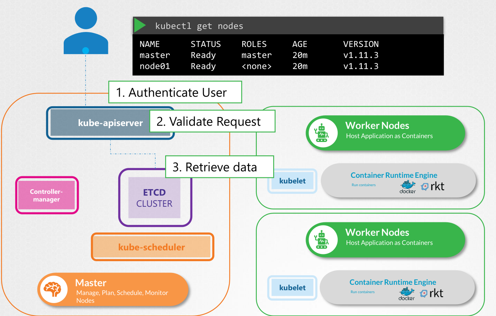
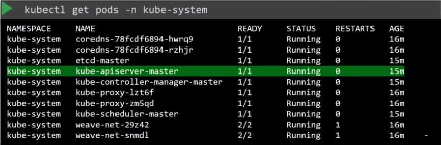

# kube-apiserver

- It's the primary management component of the kubernetes cluster
- Orchestrate all operations within the cluster
- Can be accessed via `kubectl` or via `rest`



- **Responsabilities**

  - `Authenticate`
  - `Validate Request`
  - `Retrieve Data`
  - `Update ETCD`

- kube-apiserver is the only one component that interacts directly with ETCD. kube-scheduler and kubelet can update etcd but by means of the kube-apiserver

- Example: creating a pod
  1. user requests a new pod (kubectl or rest)
  1. kube-apiserver receives the request and consults etcd cluster to check if it already exists or has changed
  1. kube-apiserver then pass info to the kube-scheduler for a new pod creation
  1. kube-apiserver contacts the correct node kubelet to deploy the container
  1. kubelet responds to kube-apiserver with the current node status
  1. kube-apiserver updates etcd

## Setup

### From scratch

- `kube-apiserver.service` must be configured manually if running a kubernetes cluster from scratch

```shell
# Download kube-apiserver binary
wget "https://storage.googleapis.com/kubernetes-release/release/v1.13.0/bin/linux/amd64/kube-apiserver"
```

```conf
ExecStart=/usr/local/bin/kube-apiserver \\
  --advertise-address=${INTERNAL_IP} \\
  --allow-priviledged=true \\
  --apiserver-count=3 \\
  --authorization-mode=Node,RBAC \\
  --bind-address=0.0.0.0 \\
  --enable-admission-plugins=Initializes,NamespaceLifecycle,NodeRestriction,LimitRanger,ServiceAccount,DefaultStorageClass,ResourceQuota \\
  --enable-swagger-ui=true \\
  --etcd-servers=https://127.0.0.1:2379 \\
  --event-tt=1h \\
  --experimental-encryption-provider-config=/var/lib/kubernetes/encryption-config.yaml \\
  --runtime-config=api/all \\
  --service-account-key-file=/var/lib/kubernetes/service-account.pem \\
  --service-cluster-ip-range=10.32.0.0/24 \\
  --service-node-port-range=30000-32767 \\
  --v=2
```

- The options can be viewed at `/etc/systemd/system/kube-apiserver.service`
- Or see the running options `px -aux | grep kube-apiserver`

### Via kubeadm

- `kubeadm` install the service automatically as a pod `kube-apiserver` inside of the `kube-system` namespace
- The pod is deployed on the master node



- The options can be viewed at `/etc/kubernetes/manifests/kube-apiserver.yaml`

## Certificates

```shell
# generate kube-apiserver private key
openssl genrsa -out "apiserver.key" "2048"

# certificate signing request
openssl req \
  -new \
  -key "apiserver.key" \
  --config "openssl.cnf" \
  -subj "/CN=kube-apiserver" \
  -out "apiserver.csr"

# sign with ca
openssl x509 \
  -req \
  -in "apiserver.csr" \
  -signkey "ca.key" \ # ca private key
  -out "apiserver.crt"
```

```conf
[req]
req_extensions = v3_req

[v3_req]
basicConstraints = CA:FALSE
keyUsage = nonRepudiation,
SubjectAltName = @alt_names

[alt_names]
DNS.1 = kubernetes
DNS.2 = kubernetes.default
DNS.3 = kubernetes.default.svc
DNS.4 = kubernetes.default.svc.cluster.local
IP.1 = 10.96.0.1
IP.2 = 172.17.0.87
```

```conf
ExecStart=/usr/local/bin/kube-apiserver \\
  ... \\

  # server certificate
  --client-ca-file=/var/lib/kubernetes/ca.pem \\
  --tls-cert-file=/var/lib/kubernetes/apiserver.crt \\
  --tls-private-key-file=/var/lib/kubernetes/apiserver.key \\

  # client certificate (to connect with etcd)
  --etcd-cafile=/var/lib/kubernetes/ca.pem \\
  --etcd-certfile=/var/lib/kubernetes/apiserver-etcd-client.crt \\
  --etcd-keyfile=/var/lib/kubernetes/apiserver-etcd-client.key \\

  # client certificate (to connect with kubelet)
  --kubelet-client-certificate=/var/lib/kubernetes/apiserver-kubelet-client.crt \\
  --kubelet-client-key=/var/lib/kubernetes/apiserver-kubelet-client.key \\
```

## API Server

- **Groups**
  - `Core group`
    - /api/v1/ns
    - /api/v1/po
    - /api/v1/svc
  - `Named group`
    - /apis/apps
    - /apis/extensions
    - /apis/networking.k8s.io
    - /apis/storage.k8s.io
    - /apis/authentication.k8s.io
    - /apis/certificates.k8s.io
  - `Other groups`
    - /version
    - /metrics
    - /healthz
    - /logs
- **Resources**
  - /apis/apps/`deployments`
  - /apis/apps/`statefulsets`
  - ...
- **Verbs**
  - List
  - Get
  - Create
  - Delete
  - Update
  - Watch

### kubectl

- Kubectl is the k8s command-line tool
- Kubectl manages the master in the k8s cluster
- Instructions <https://kubernetes.io/docs/tasks/tools/install-kubectl/>

```shell
# Download binary
curl -LO "https://storage.googleapis.com/kubernetes-release/release/$(curl -s https://storage.googleapis.com/kubernetes-release/release/stable.txt)/bin/linux/amd64/kubectl"

# Make it executable
chmod +x "./kubectl"

# Move it to PATH
sudo mv "./kubectl" "/usr/local/bin/kubectl"

# Check installation version
kubectl version

# Information about the cluster
kubectl cluster-info
```

### rest

```shell
# Get all API groups
curl -X GET "https://10.10.10.10:6443/" --header "Authorization: Bearer my-jwt" --insecure
```

```shell
# Authentication
curl -X GET "/api/v1/pods" -u "user:pass" # basic auth
curl -X GET "/api/v1/pods" --header "Authorization: Bearer my-token" # token auth
curl -X GET "/api/v1/pods" --key "admin.key" --cert "admin.crt" --cacert "ca.crt" # certificate auth
```

```shell
# get pods
curl -X GET "/api/v1/pods" -u "user:pass"

# create pod
curl -X POST "/api/v1/namespaces/default/pods"
```
