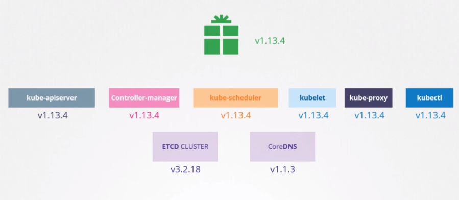

# Kubernetes Cluster Upgrade

- First stable version: v1.0 (July 2015)
- Kubernetes supports up to 3 versions at a time. E.g., 1.21, 1.20, 1.19

## Compatibility

- `kube-apiserver`: must be the higher version of the control plane
- `kube-controller-manager` & `kube-scheduler`: can have up to 1 minor version lower
- `kubelet` & `kube-proxy`: can have up to 2 minor versions lower
- `kubectl`: can have any version

## Upgrade Process

- The version must be upgraded one at time! (minor by minor)
- Steps

  1. `Upgrade masters`: upgrade the control plan
  1. `Upgrade workers`: upgrade one one by one or add nodes with newer version
