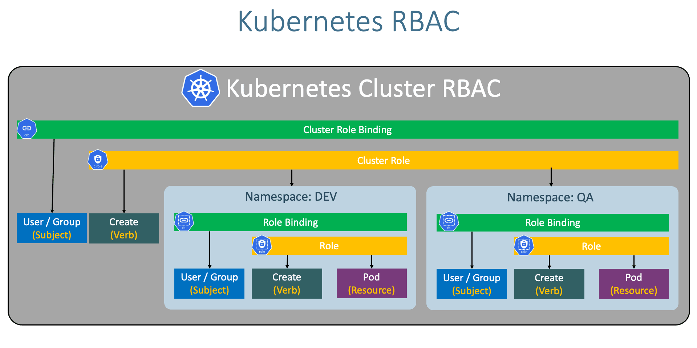

# Authorization

- Authorization Modes

  - `ABAC Authorization`
  - `RBAC Authorization`
  - `Node Authorization`
  - `WebHook Mode`
  - `AlwaysAllow`
  - `AlwaysDeny`

- The authorization mode is defined in the `kube-apiserver`
- If multiple authorization modes are defined, user tries to authorize in each one of them until it of one them passes

```conf
ExecStart=/usr/local/bin/kube-apiserver \\
  ... \\
  --authorization-mode=Node,RBAC,Webhook
```

## ABAC (Atribute Based Access Control)

- Authorize user/group to a set of permissions
- E.g., view, create, delete PODs

```json
[
  {
    "kind": "Policy",
    "spec": {
      "user": "dev-user",
      "namespace": "*",
      "resource": "pods",
      "apiGroup": "*"
    }
  },
  {
    "kind": "Policy",
    "spec": {
      "user": "security-user",
      "namespace": "*",
      "resource": "csr",
      "apiGroup": "*"
    }
  }
]
```

## RBAC (Role Based Access Control)

- **Subject**: entity that needs access to Kubernetes API
  - Kind: User
  - Kind: Group
  - Kind: Service Account
- **Resource + API Group**: kubernetes object that we grant access to
  - apps/Deployment, core/Pod, core/Service
- **Verbs**: list of actions that can be performed
  - Create, List, Watch, Get, ...

Roles & Bindings



- A `ClusterRoleBinding` is a subject to be bound to a `ClusterRole`, which is a verb + non-namespaced resource
- A `RoleBinding` is a subject to be bound to a `Role`, which is a verb + namespaced resource

## Node Authorization

- Authorize nodes (`kubelets`) to invoke `kube-apiserver` methods
- Kubelets are part of the `SYSTEM:NODES` group

## Webhook

- Use third-party to help with admission control and authorization
- E.g., `Open Policy Agent`
- The third-party service then decides if the user is permitted or not

## AlwaysAllow

- Allow everything

## AlwaysDeny

- Deny everything
