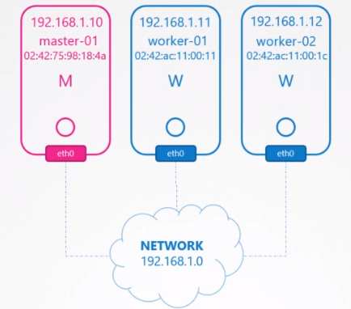
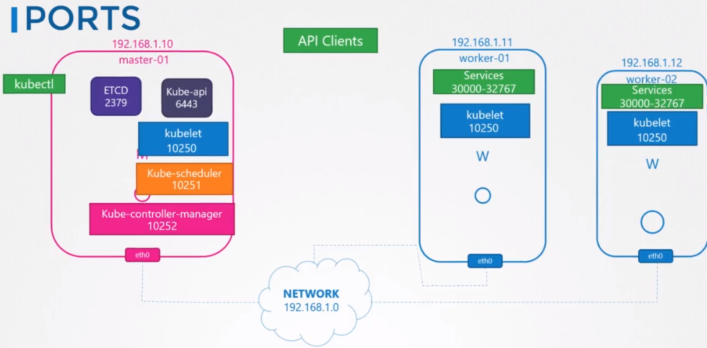
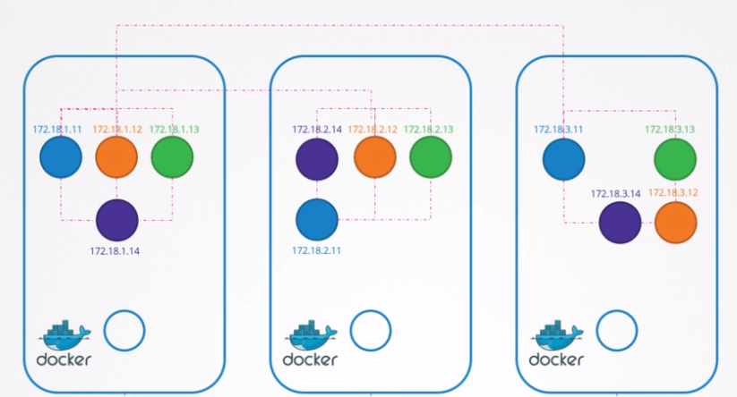

# Networking

- Each `node` must have at least one `interface` connected to the network
- Each `interface` must have an `address` configured
- `Hosts` must have a unique `hostname` and `mac address`



## Ports

- `kube-apiserver`: 6443
- `etcd`: 2379 (2380 for etcd p2p connection)
- `kubelet`: 10250
- `kube-scheduler`: 10251
- `kube-controller-manager`: 10252

- Worker node expose services for external access on ports `30000-32767`



## Networking Model (Between pods)

- Every pod should have an IP Address
- Every pod should be able to communicate with every pod in the same node
- Every pod should be able to communicate with every pod on other nodes without NAT



## CNI

- Whenever a container is manipulated, `kubelet` executes a script defined by the CNI config
- `--cni-conf-dir=/etc/cni/net.d`: configuration so that kubelet knows which plugin to use
- `--cni-bin-dir=/etc/cni/bin`: binary for all supported plugins

```shell
./net-script.sh add "container" "namespace"
```

- `ADD`
  1. Create veth pair
  1. Attach veth pair
  1. Assign IP address
  1. Bring Up Interface

## WeaveWorks

- An weaver `agent` is deployed on the node and stores the topology of the entire setup
- Agents communicate with each other to update its topology info
- Weaver is deployed as `DaemonSet`
