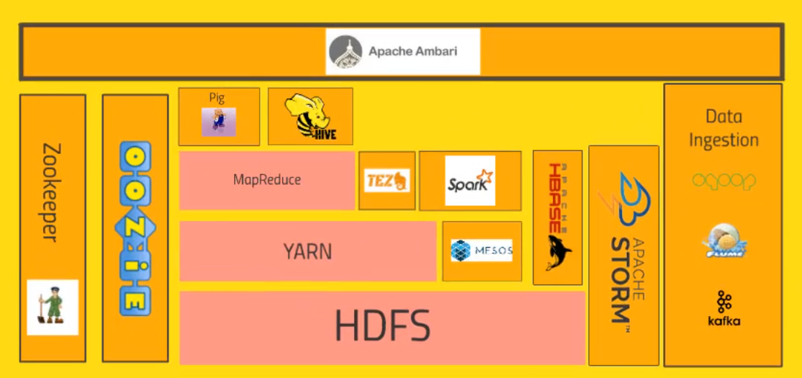
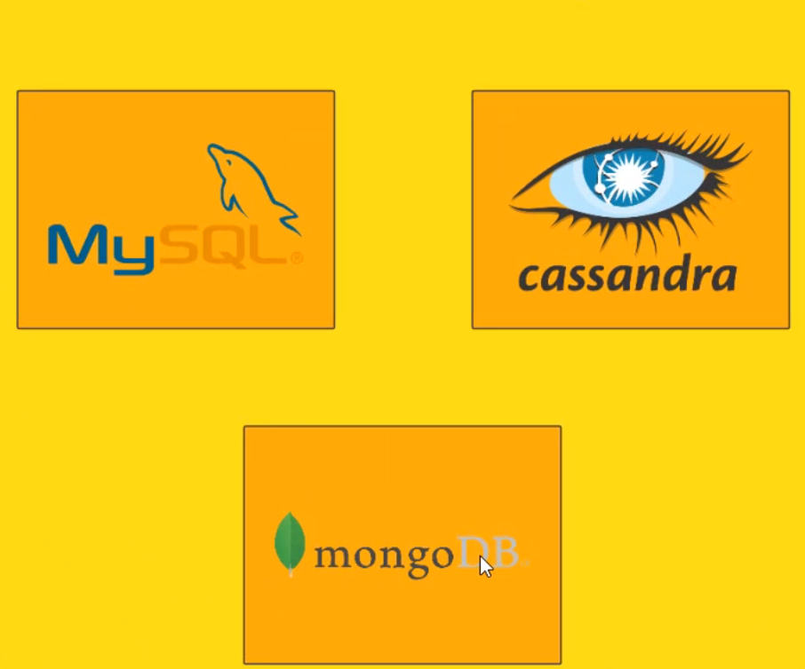
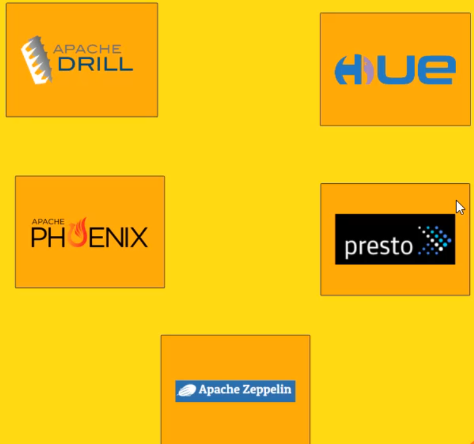

# Hadoop

- It's an open source software platform for `distributed storage` and `distributed processing` of `large datasets` on `computer clusters`
- A tool to `analyze` and `transform` massive amount of data
- Hadoop filesystem: `HDFS`

- Started with Google in 2003
  - `Google Filesystem (GFS)`: for distributed storage
  - `MapReduce`: for distributed processing

## Hadoop Ecosystem

- **Core Hadoop Ecosystem**

  - `HDFS`
    - Hadoop Distributed File System
    - Consolidate the content of various hard drivers into a giant single drive
    - Backup, replication and restore mechanisms
  - `Yarn`
    - Yet Another Resource Negotiator
    - Manages the computing resources on the system
    - Decides what gets to run, when and where
  - `Mesos`
    - Alternative to Yarn (solves the same problem)
  - `MapReduce`
    - Programming model to process data across the cluster
    - Mappers: transforms the data
    - Reducers: aggregate the data together
  - `Pig`
    - Alternative to write mapreduce code (instead of using java, python, etc)
    - Good for simple scripts and tasks
  - `Hive`
    - Allows fetching data from HDFS using SQL queries
    - It's a translation layer
    - Hive can be used with MapReduce or Tez
  - `Spark`
    - Run queries to process or fetch data on your cluster
    - Can be used with yarn or mesos
    - Spark scripts can be written in Python, Java or Scala
    - Handles SQL queries, do machine learning, streams data in real time
  - `Tez`
    - Uses same technique as Spark
    - Crete plans to execute the queries
  - `HBase`
    - A way to expose the data on the cluster to transaction platforms (other systems)
    - NoSQL database (Wide-Column Datastore)
  - `Storm`
    - A way to process streaming data. E.g., data from sensors
  - `Oozie`
    - A way to schedule jobs on the cluster
  - `Zookeeper`
    - Coordination of everything on the cluster
    - Shares the state across the cluster
    - E.g., which nodes are down/up
  - `Ambari`
    - It's a dashboard to manage all the hadoop components
    - Have a view about the current state of the cluster
    - Used by the Hortonworks hadoop distribution
  - `Scoop`
    - Tie the hadoop fs into a relational database
    - It's a connector between hadoop and legacy databases
  - `Flume`
    - Listen to web logs coming from web servers in real time and save in the HDFS
  - `Kafka`
    - Data in/out of the cluster

- 

- **External Storage**

  - `MySQL`
    - A way to expose the data for real time usable
  - `Cassandra`
    - A way to expose the data for real time usable
  - `MongoDB`
    - A way to expose the data for real time usable
  - `Hbase`
    - It's part of the hadoop core

- 

- **Query Engines**

  - `Drill`
    - SQL queries
    - Fetch data across multiple NoSQL databases
    - Consolidate the data together
  - `Hue`
    - Queries
  - `Phoenix`
    - SQL queries
    - Has some additional guarantees
  - `Presto`
    - Queries
  - `Zeppelin`
    - Notebook UI approach
  - `Hive`
    - It's part of the hadoop core

- 

## Hadoop Distributions

- Hadoop distributions are used to provide scalable, distributed computing against on-premises and cloud-based file store data
- Distributions are composed of commercially packaged and supported editions of open-source `Apache Hadoop-related` projects
- Distributions provide access to applications, query/reporting tools, machine learning and data management infrastructure components.

- Distributions
  - `Cloudera Hadoop` (CDH)
    - A cloud solution
    - <https://www.cloudera.com/downloads/cdh.html>
  - `Hortonworks Data Platform` (HDP)
    - Bought by cloudera
    - <https://www.cloudera.com/downloads/hortonworks-sandbox/hdp.html>
  - `MapR`
    - <www.mapr.com>
