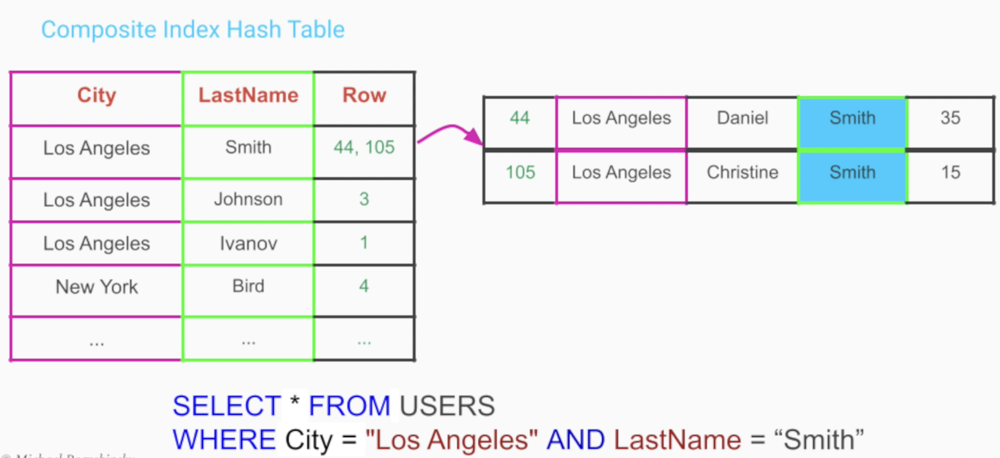

# Indexes

- A `database index` is a helper table, created from a particular column/group of columns
- Reduce the time to make a query to a sublinear time
- Queries no longer have to make a full table scan
- **Tradeoff**
  - Additional space for storing the index tables
  - Slower write operations

## Hash Table Indexes

- `Each value` of the indexed column is hashed and partitioned into separate "buckets"
- The search operation can then scan only the bucket in which the the actual data might be located

- Indexes can also be created out of multiple columns. This is the `composite index`

## Binary Tree (B-Tree) Indexes

- `Range of values` can be indexed, the values need to be comparable

