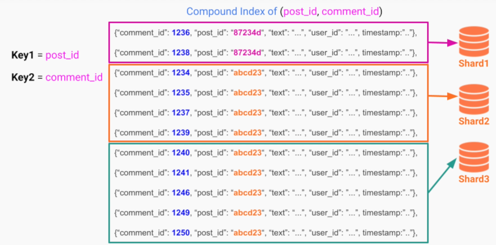

# Sharding / Partitioning

- Slipt the data (not replicate) among several database instances

- **Pros**
  - Distribute the load evenly
  - Increase throughput
- **Cons**
  - Adds overhead of traffic routing
  - Do not solve failure recovery situations

- Sharding can also be applied for the whole infrastructure
  - Example 1: premium users requests go to faster machines
  - Example 2: the whole user base is split to reduce potential blast radius

## Hash sharding strategy

- `Hash Function`: same hashing output go to same shard

## Range sharding strategy

- Has a `partition key` (hash) and a `sort key` (range)
- The `partition key` (hash key) is the first strategy for shard allocation
- The `sort key` (range) sorts the with a same partition key the data is slipt to another shard if the first one gets too full

## Compound sharding

- Use two or more fields as input for the hashing function
- E.g., use user-creation-year + user-country for sharding
  - All the users from a X country created in a X year go to the same shard

## Range
