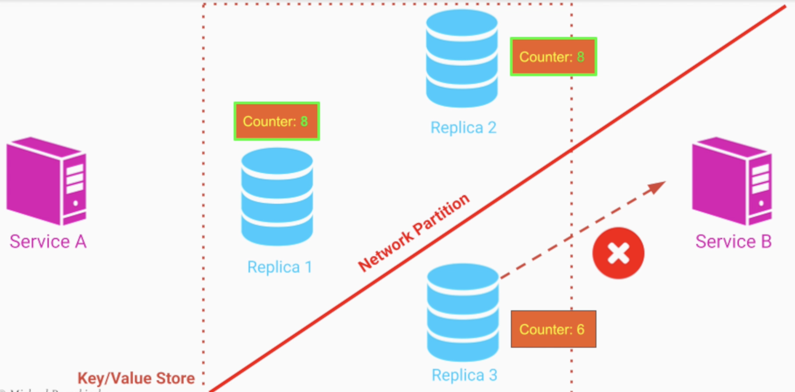

# CAP Theorem

- Cannot have always the 3 of them!
- It's a concern of distributed databases

> In the presence of a Network Partition, a distributed database cannot guarantee both Consistency and Availability and has to choose only one of them

- **Consistency**
  > "Every read request receives either the most recent write or an error"
- **Availability**
  > "Every request receives a non-error response, without the guarantee that it contains the most recent write"
- **Partitioning** (Network Partition Tolerance)
  > "The system continues to operate despite an arbitrary number of messages being lost or delayed by the network between different computers"

## CP (Favors Consistency)

- The write is incomplete until it’s replicated to all the other machines
- But what if at the write there was a partition failure? Write will never be complete
  - Availability will never be reached in this case

- `Traits`
  - Pessimistic locking
  - Make minority partitions unavailable

- `Applicable use-case`
  - Only shopping item count.

- `Databases`
  - HBase, MongoDB, Redis, BigTable
  - Distributed Locking (Apache Zookeeper)
  - Majority protocols

## AP (Favors Availability)

- The failed server will not be updated
- Failed server will show outdated results
- Consistency not reached!

- `Examples`
  - Cassandra, Riak, CouchDB
  - DNS

- `Applicable use-case`
  - Quantity of likes of given video

- `Traits`
  - NSPF (No Single Point of Failure)
  - Conflict resolution
  - Optimistic

## CA (Do not partition)

- When there is not a network partition (e.g., single centralized database in a single machine) the availability and consistency are both achieved together

- `Examples`
  - Relational databases (Oracle, Mysql, Postgresql, Microsoft SQL Server, IBM DB/2)
