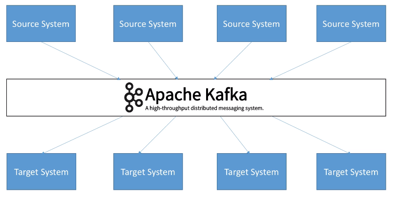
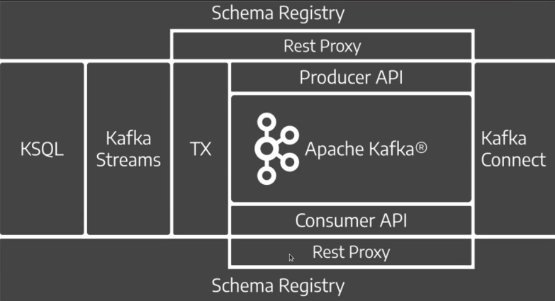

# Kafka

- `Kafka` is an open source stream process platform
- Created by `LinkedIn` in 2011, now it's maintained by `Confluent`
- Solves problem with data
  - `Protocol`: how the data is transported (TCP, HTTP, REST, FTP, JDBC)
  - `Data format`: how the data is parsed (Binary, CSV, JSON, Avro)
  - `Data schema`: how the data is shaped and may change (evolved)
- Benefits
  - `Distributed`
  - `Fault tolerant`
  - `Resilient`
  - `High throughput`
  - `Scaling`
  - `Persistent storage`
  - `Decouple` the systems
- Use cases
  - Messaging System
  - Activity tracking
  - Gather metrics from different locations
  - Logs gathering
  - Stream processing
  - Decouple dependencies
- Events
  - Events are `facts` (metrics, reports, logs, notifications, etc)
  - E.g., a paid bill (cannot be undone) - The only way to reverse a fact is to undo it, E.g., Reimburse
  - Differently from messages, it reports things that already happened
  - `Messages` are intentions! E.g. commands, requests, consults
  - Kafka is designed to deal with events! `Event driven`

## Kafka guarantees

1. Messages are appended to a topic-partition in the order they are sent
1. Consumers read messages in the order stored in a topic-partition
1. With replication factor of N, clients (producers and consumers) can tolerate up to N-1 brokers being down
1. Message with a key will always go to the same partition (as long as the number of partitions remains constant for a topic)

## Kafka ecosystem

- **Rest Proxy**: Conversion of consumer and producer API to REST. Kafka Bridge (Red Hat)
- **Kafka Streams**: Implement streaming in a declarative way. It's a client library (run at the producer/consumer) `Continuous flux of data`. There is no way to tell when it started and when it will end (Time windows).
- **Schema Registry**: By Confluent or Red Hat (Apicurio). Avro, Protobuf, etc.
- **Kafka Connect**: Connect kafka cluster to other systems. Both inbound as outbound data. E.g., inbound data from MySQL or SAP
- **TX**: Transaction API
- **kSQL**: SQL like syntax to run queries on kafka (it's built on top of kafka streams)

## Kafka Addons

- [CMAK](https://github.com/yahoo/CMAK): Cluster Manager for Apache Kafka
- [Cruise Control](https://github.com/linkedin/cruise-control): Cruise Control for Apache Kafka
- [Strimzi](https://strimzi.io/): Apache Kafka on Kubernetes
- [Grafana](https://grafana.com/): Monitor everything, metrics, logs, etc
- [Conduktor](https://www.conduktor.io/): Kafka UI
- [Keda](https://github.com/kedacore/keda): Auto scale the brokers based on the consumer lag
