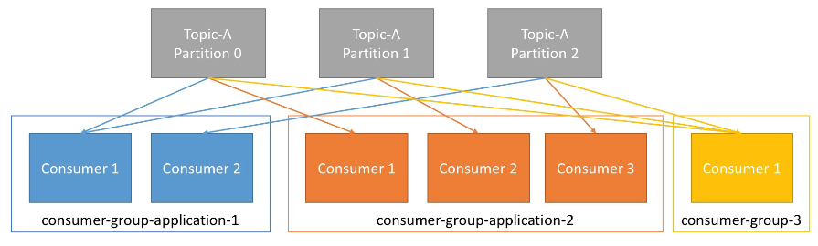
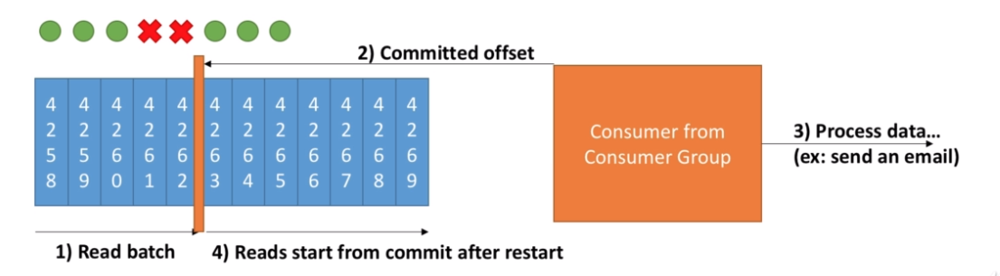
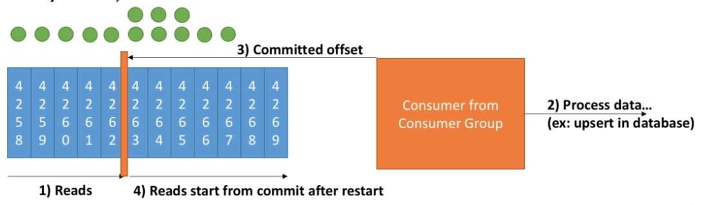

# Consumer

- Consumers `read data` from a topic
- Consumers know which broker to read from
- In case of broker failure, consumer knows how to recover
- Data is read in order within each partition! Cannot read offset 3 before 2
- Data is read in parallel from different partitions (can be out of order)
- Data can be consumed `per offset` (seek) or `per timestamp` (offsetPerTime)
- The consumer is oriented to `pooling` (asks the server frequently if there is data)

## Consumer groups

- Consumer read data in consumer groups (`group.id`)
- In consumers in a consumer group, will never receive a same message
- Each partition can be read by only one consumer in a consumer group. If there are more consumers than partitions, some consumers will be idle
  - Usually you want to have the same number of partitions and consumers
- Consumers will automatically use a `GroupCoordinator` and a `ConsumerCoordinator` to assign a consumer to a partition
- When a new consumer joins the same consumer group, kafka performs a `group rebalancing`. To evenly distribute partitions to the consumers
- Group rebalancing also happens when a consumer exits the group



## Consumer offsets

- Kafka stores the offsets that a consumer group has read! Like a checkpoint
- A offset is read after it has been `committed`. The commit is the action to write in the `__consumer_offsets` topic
- The commit is the highest `offset` that a consumer group has read for each partition
- Offsets that have been read are stored at a topic named `__consumer_offsets` (committed offsets)
- It is important because the consumer can know where is has stopped, if case it goes down
- `Idempotence` does NOT exist in consumer, the broker cannot know if consumer has processed it. Therefore it must be implemented manually on the consumer side by an event/message id for example

- **enable.auto.commit=true**: Offsets are committed automatically at a regular interval (auto.commit.interval.ms=5000) every-time you call .poll()
- **enable.auto.commit=false**: Commit with `consumer.commitSync()`

### Offset reset

- Consumer offset reset behavior
- `auto.offset.reset`
  - latest: start reading from last committed offset
  - earliest: start reading from offset 0
  - none: throws exception if no offset is found

## Delivery semantics

- Consumers `choose when to commit the offsets` that were read
- Delivery semantics means how many times a message can be delivered to the same consumer in a consumer group

- **At most once** (not preferred)
  - Offset committed as soon as the message is received
  - If the processing goes wrong, the message is lost



- **At least once** (preferred - default)
  - Commit offsets only after the message is processed.
  - If processing goes wrong, the message will be read again.
  - This can result i duplicate processing (make sure to make your consumer idempotence to avoid it - not related to kafka producer idempotence)



- **Exactly once**:
  - Kafka workflows using Kafka Streams API

## Consuming

- **Conventional**: automatically consume last messages from any partition

  ```java
  Logger logger = LoggerFactory.getLogger(ConsumerDemo.class.getName());
  String bootstrapServers = "localhost:9092";
  String groupId = "my-first-application";
  String topic = "first_topic";

  // consumer properties
  Properties properties = new Properties();
  properties.setProperty(ConsumerConfig.BOOTSTRAP_SERVERS_CONFIG, bootstrapServers);
  properties.setProperty(ConsumerConfig.KEY_DESERIALIZER_CLASS_CONFIG, StringDeserializer.class.getName());
  properties.setProperty(ConsumerConfig.VALUE_DESERIALIZER_CLASS_CONFIG, StringDeserializer.class.getName());
  properties.setProperty(ConsumerConfig.GROUP_ID_CONFIG, groupId);
  properties.setProperty(ConsumerConfig.AUTO_OFFSET_RESET_CONFIG, "earliest"); // earliest: very beginning, latest: new messages, none

  // consumer
  KafkaConsumer<String, String> consumer = new KafkaConsumer<String,String>(properties);

  // subscribe consumer to a topic
  //consumer.subscribe(Collections.singleton(topic)); // singleton only subscribe to one topic
  consumer.subscribe(Arrays.asList(topic)); // array of topics

  // poll for new data
  while(true){
    ConsumerRecords<String, String> records = consumer.poll(Duration.ofMillis(100));

    for(ConsumerRecord<String, String> record: records) {
      logger.info("Key: " + record.key() + "\n" +
                  "Value: " + record.value() + "\n" +
                  "Partition: " + record.partition() + "\n" +
                  "Offset: " + record.offset());
    }
  }
  ```

- **Assign And Seek**: mostly used to replay data or fetch a specific message. Assign and seek needs no consumer group and does not commit message

  ```java
  Logger logger = LoggerFactory.getLogger(ConsumerDemo.class.getName());
  String bootstrapServers = "localhost:9092";
  String topic = "first_topic";

  // consumer properties
  Properties properties = new Properties();
  properties.setProperty(ConsumerConfig.BOOTSTRAP_SERVERS_CONFIG, bootstrapServers);
  properties.setProperty(ConsumerConfig.KEY_DESERIALIZER_CLASS_CONFIG, StringDeserializer.class.getName());
  properties.setProperty(ConsumerConfig.VALUE_DESERIALIZER_CLASS_CONFIG, StringDeserializer.class.getName());
  properties.setProperty(ConsumerConfig.AUTO_OFFSET_RESET_CONFIG, "earliest"); // earliest: very beginning, latest: new messages, none

  // consumer
  KafkaConsumer<String, String> consumer = new KafkaConsumer<String,String>(properties);

  // assign
  TopicPartition partitionToReadFrom = new TopicPartition(topic, 0); // specify a partition to read from
  long offsetToReadFrom = 15L; // start from offset 15
  consumer.assign(Arrays.asList(partitionToReadFrom));

  // seek
  consumer.seek(partitionToReadFrom, offsetToReadFrom);

  // poll for new data
  int numberOfMessagesToRead = 5;
  boolean keepOnReading = true;
  int numberOfReadMessagesSoFar = 0;
  while(keepOnReading){
    ConsumerRecords<String, String> records = consumer.poll(Duration.ofMillis(100));

    for(ConsumerRecord<String, String> record: records) {
      logger.info("Key: " + record.key() + "\n" +
                  "Value: " + record.value() + "\n" +
                  "Partition: " + record.partition() + "\n" +
                  "Offset: " + record.offset());
      numberOfReadMessagesSoFar += 1;
      if (numberOfReadMessagesSoFar >= numberOfMessagesToRead) {
        keepOnReading = false; // to exit the while loop
        break; // exit the for loop
      }
    }
  }
  logger.info("Exiting the application");
  ```

## Consumer Liveliness

- Consumers in a group talk to a `Consumer Groups Coordinator`
- The `heartbeat` mechanism detects in a consumer is down
  - `session.timeout.ms` defines maximum time to tolerate not receiving a heartbeat. After that the consumer is considered dead(default 10ms)
  - `heartbeat.interval.ms` defines the heartbeat interval to be sent to the group coordinator (default 3ms). Set 1/3 of the session.timeout
  - `max.poll.interval.ms`: maxium time between 2 .poll() calls before declaring the consumer dead. Change it if your processing takes a long time
