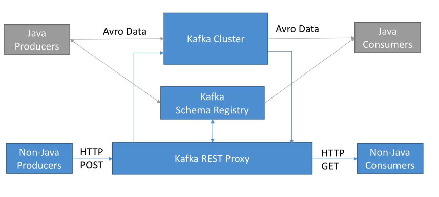

# Rest Proxy

- `REST Proxy` is used to allow clients to use HTTP requests to produce/consume messages to/from kafka
- Rest Proxy was created by Confluent, an alternative is the `Kafka Bridge`, created by Red Hat



- The performance decreases 3 to 4 times with the HTTP protocol
- Content-Type: `application/vnd.kafka.avro.v2+json` (avro, binary or json)
- Accept: `application/vnd.kafka.v2+json`

## Get topics

```shell
# Get all topics
curl --request "GET" "http://localhost:8082/topics"

# Get a topic config
curl --request "GET" "http://localhost:8082/topics/my-topic"
```

## Produce

- `key` field specifies the key for the message
- `partition` forces message to go to partition N
- If no key or partition is specified the message goes round robin to the partitions

```shell
# Produce BINARY data (key and value must be base64 encoded)
curl --request "POST" "http://localhost:8082/topics/my-topic" \
  --header 'Content-Type: application/vnd.kafka.binary.v2+json' \
  --header 'Accept: application/vnd.kafka.v2+json' \
  --data-raw
  '
  {
    "records": [
      {
        "key": "a2V5",
        "value": "SGVsbG9Xb3JsZAo="
      },
      {
        "partition": 0,
        "value": "SGVsbG9Xb3JsZAo="
      },
      {
        "value": "SGVsbG9Xb3JsZAo="
      }
    ]
  }
  '

# Produce JSON data
curl --request "POST" "http://localhost:8082/topics/my-topic" \
  --header 'Content-Type: application/vnd.kafka.json.v2+json' \
  --header 'Accept: application/vnd.kafka.v2+json' \
  --data-raw
  '
  {
    "records": [
      {
        "key": "somekey",
        "value": "{"foo":"bar"}"
      },
      {
        "partition": 0,
        "value": "["foo", "bar"]"
      },
      {
        "value": 53.5
      }
    ]
  }
  '

# Produce AVRO data
curl --request "POST" "http://localhost:8082/topics/my-topic" \
  --header 'Content-Type: application/vnd.kafka.avro.v2+json' \
  --header 'Accept: application/vnd.kafka.v2+json' \
  --data-raw
  '
  {
    "value_schema": "{\"type\": \"record\", \"name\": \"User\", \"fields\": [{\"name\": \"name\", \"type\": \"string\"}, {\"name\" :\"age\",  \"type\": [\"null\",\"int\"]}]}\",
    "value_schema_id": 25 /* the schema id replaces the value_schema, use schema id only after the schema has already been registered */
    "records": [
      {
        "partition": 0,
        "value": { "name": "testUser", "age": null}
      },
      {
        "value": { "name": "testUser", "age": {"int":25} } /* with union type you must specify the type*/
      }
    ]
  }
  '
```

## Consume

```shell
# Create consumer (binary, json or avro)
curl --request "POST" "http://localhost:8082/consumers/my-consumer-group" \
  --header 'Content-Type: application/vnd.kafka.v2+json' \
  --data-raw
  '
  {
    "name": "my-consumer",
    "format": "binary", /* binary, json or avro */
    "auto.offset.reset": "earliest",
    "auto.commit.enable": "false"
  }
  '

# Subscribe to a topic
curl --request "POST" "http://localhost:8082/consumers/my-consumer-group/instances/my-consumer/subscription" \
  --header 'Content-Type: application/vnd.kafka.v2+json' \
  --data-raw
  '
  {
    "topics": [
      "my-topic"
    ]
  }
  '

# Consume records (binary, json or avro)
curl --request "GET" "http://localhost:8082/consumers/my-consumer-group/instances/my-consumer/records?timeout=3000&max_bytes=300000" \
  --header 'Accept: application/vnd.kafka.binary.v2+json'

# Commit offsets
curl --request "POST" "http://localhost:8082/consumers/my-consumer-group/instances/my-consumer/offsets" \
  --header 'Content-Type: application/vnd.kafka.v2+json' \
  --data-raw
  '
  {
    "offsets": [
      {
        "topic": "my-topic",
        "partition": 0,
        "offset": 2
      }
    ]
  }
  '
```
