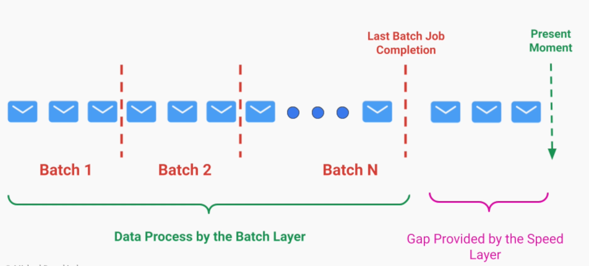
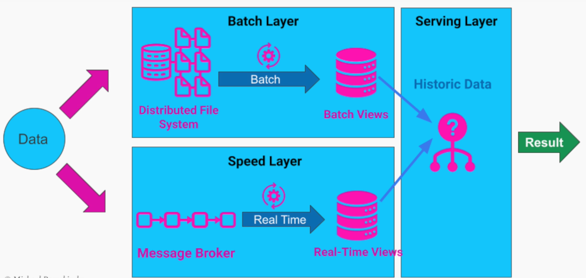
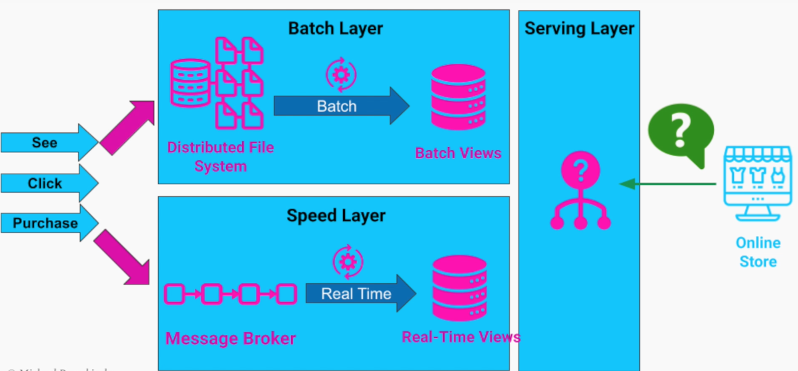

# Lambda Architecture

- Created by `Nathan Marz`
- It exists to compensate the gaps between `batch processing` and `real-time processing` in data ingestion
- It attempts to find a balance between
  - High Fault Tolerance and comprehensive analysis of data (Batch processing)
  - Low Latency (Real-time processing)

## Anomaly detection

- There are cases in which both the `historic data` (batch processing) and the `real time data` (real-time processing) is needed

- Example 1:
  - Detect anomaly in the throughput
  - A sudden drop in the throughput (potentially caused by code changes) may be alerted

- Example 2:
  - A ride sharing service a rider wants to match with a driver
  - The service needs real time data from the driver and rider
  - The service needs historic data to verify busy times/days to allocate drivers to the right area

## Layers

1. **Batch Layer**
    - The historic data is read from a `distributed file system` (or a blob store)
    - The data is processed in batches in a fixed time frame (e.g., every 1 hour)
    - The result of the processing (the `batch view`) is saved back to the distributed file system (or blob store)
    - The batch view is read only
1. **Speed Layer**
    - Compensates for the high latency (delay) in the Batch Layer
    - Operates on the most recent data
1. **Serving Layer**
    - Respond to ad-hoc queries
    - Merge the data from batch + speed layers

## Real Example

- Ad-Tech Industry

Sync Part

Async Part

- Information
  - By advertiser: What number of users is currently viewing my ad? (speed layer)
  - By advertiser: What number of users saw my ad in the last 24 hours? (batch + speed layer)
  - By advertiser: How much money should I spend on advertising before a user makes a purchase? (batch layer)
