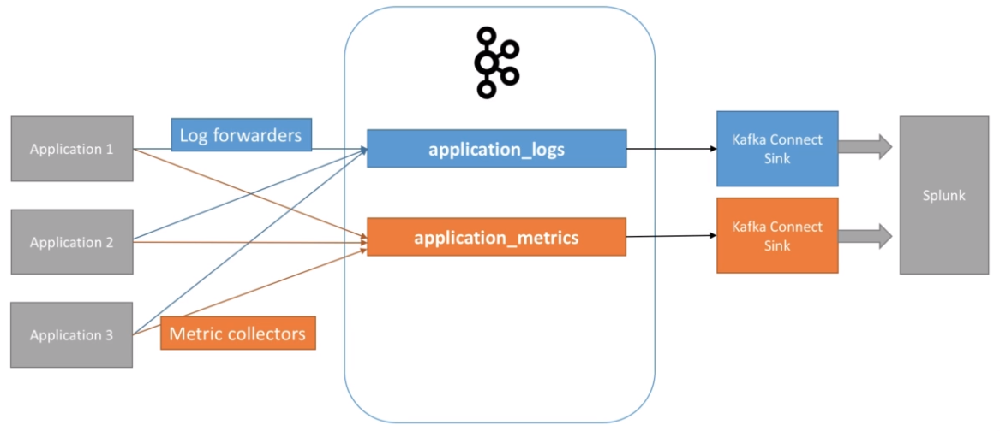

# Batch vs. Stream Processing

- The data is processed in two ways
  - **Batch processing system** (historical data)
  - **Stream processing system** (real-time data)

## Batch Processing System

- The data is available in the analytical environment `within 1 day`
- Process the data stream on a fixed schedule
- E.g., for search engines, the reachable websites are indexed in batch jobs (daily web crawler) and stored in a search-optimized database
  - It's done in batch jobs because the web crawler operation takes a long time
- There is always a delay to get the real feedback from the system
  - It may cause confusion to the users
- In some other cases this simply won't work
  - E.g., event log processing must be instantaneous

## Stream Processing System

- It's required by systems that need fresh data, often some kind of monitoring (e.g., fraud, product rollout, operational)
- The data is available in the analytical environment `within an hour`
- Each new event is processed immediately from a `stream of events`

