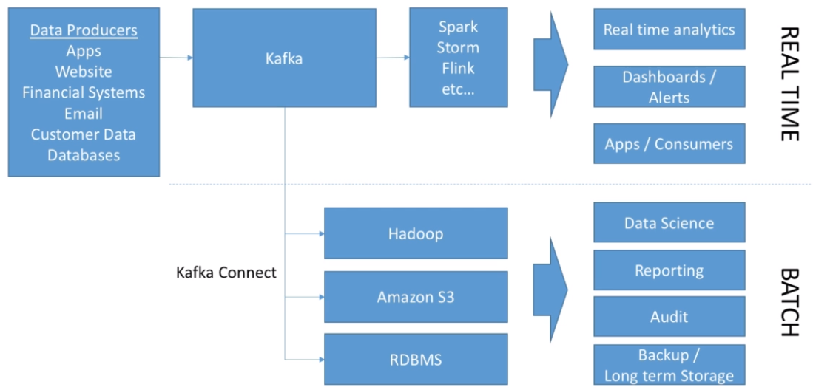

# ETL (Extract, Transform, Load)

- ETL processes are commonly used to move data **from OLTP** systems **into OLAP** systems
- It's a system that `extracts` the unstructured data from the production databases, `transforms` the data into structure and meaningful data and `loads` the data into an analytical environment
- For example, transactional data from an OLTP database could be extracted and aggregated into a data warehouse for analytical processing

## Extract

- Collects data from the transactional environment (OLTP)
- Get the raw data (e.g., database log files) and store it in a data lake (e.g., S3 with avro files)

- `Volume`: TB ~ PB /day
- `Variety`: mixed data types from multiple sources
- `Velocity`: high rate

## Transform

- Processes the collected raw data from the `data lake` and outputs data that can be used for analyses
- The raw data is `converted` into materialized views of datasets
- These datasets have `contracts` or `schemas` to help on the data analysis
- The raw data is divided into small batches of subtasks, and then processes each batch separately

## Load

- Loads the data into analytical environments or other environment
  - Data Warehouse (Google Big Query)
  - Databricks
  - Back to the transactional environment. E.g., (fraud data)

- Propagates the computed data to `BI tools` analytical environments (such as Looker, Google Data Studio) and to the production environment
- All the data that was transformed and stored can be accessed through various BI tools

- Data Governance
  - Implementing granular access control of data in the analytical environments
  - Managing PII data inventory and data subject rights
