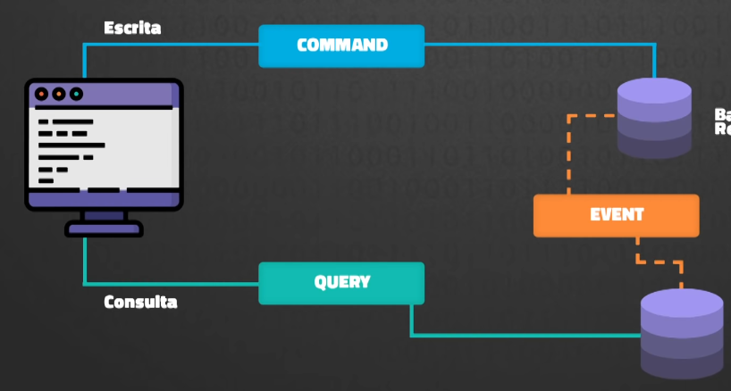
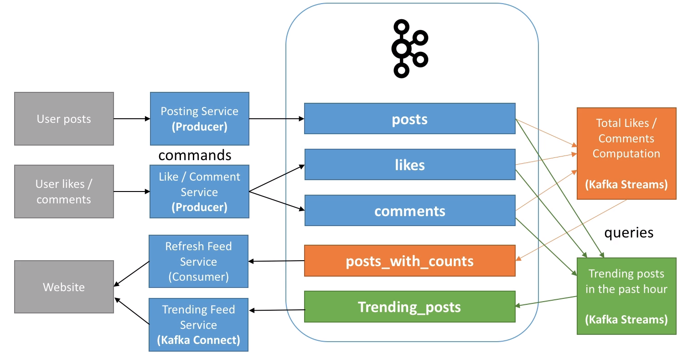

# Command Query Responsibility Segregation (CQRS)

> CQRS is an architectural pattern that separates the models for reading and writing data. This means that the data structures used for querying data (reads) are separated from the structures used for updating data (writes). This separation allows for optimization of each operation independently, improving performance, scalability, and security. CQRS can be particularly useful in complex systems where the read and write operations have very different requirements.

- <https://learn.microsoft.com/en-us/azure/architecture/patterns/cqrs>
- Responsabilities for the data aggregation (`command` and `query`) are segregated
- It's good for optimizing a database that has both high read and write operations

## Command Operation

- `Write operations` (update, create, delete)
- The write database take place in a master database, it receives all the write operations and replicate it to the read database

## Query Operation

- Read operations (select)
- Have a database optimized for read only operations

## Sync strategies

- The sync between the command and the query databases can be done by listening to the `Redo Log` from the master database
  - This way, there are no read operations to the command database

- Ways to sync the data
  - `Automatic`: synchronously sync the databases on every state state. Slow!
  - `Eventual`: asynchronously sync the databases on every state state
  - `Controlled`: sync operation is scheduled
  - `On Demand`: sync is performed when the data is requested

## Consistency

- `Eventual consistency`: updates from time to time, not immediately
- `Strong consistency`: updates on every change immediately (very difficult because there is still a small delay)
