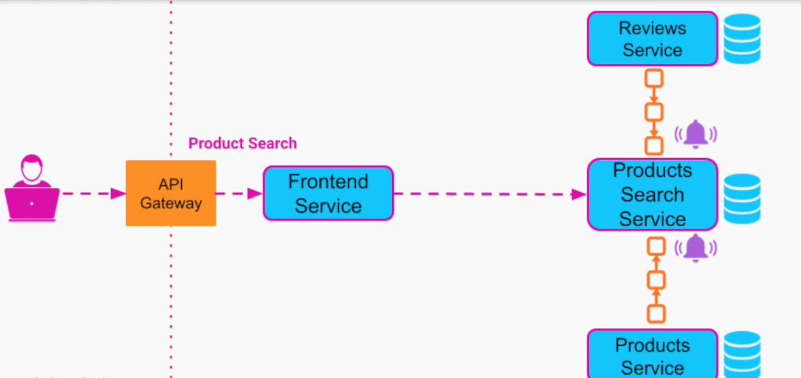

# Materialized View

> A Materialized View is a database object that contains the results of a query. It is physically stored, meaning the data is actually computed and stored on disk, as opposed to being dynamically generated upon each request. This can significantly speed up query times for complex calculations or aggregations that would otherwise need to be computed on the fly. Materialized views are especially beneficial in data warehousing and business intelligence scenarios where query performance is critical.

- <https://learn.microsoft.com/en-us/azure/architecture/patterns/materialized-view>
- A read-only database that is populated based on the events coming from multiple other databases
- This way, all the information that the service needs to operate is contained in itself and there is no need to perform multiple integrations
- A materialized view is never updated directly by an application, and so it's a `specialized cache`
- Materialized View is usually applied in conjunction with CQRS

