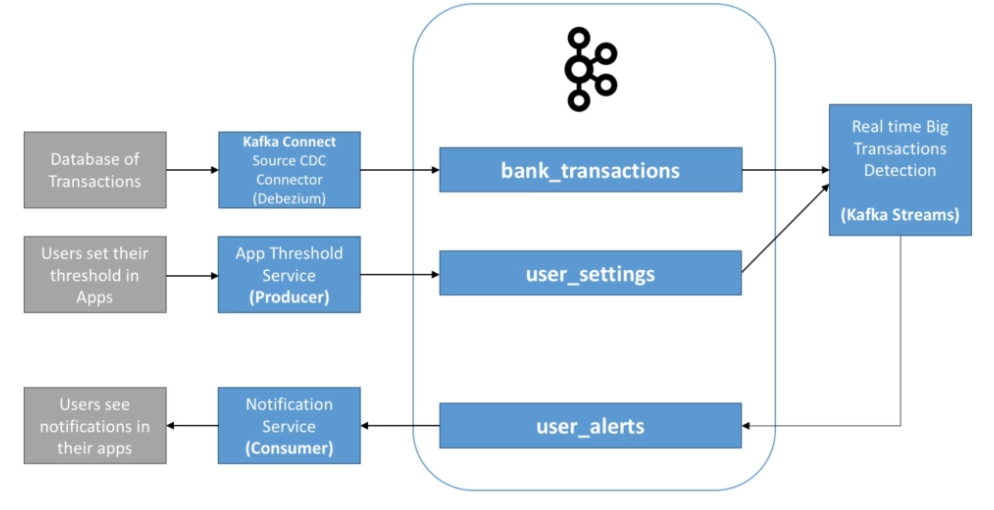

# Event Sourcing

> Event Sourcing is a pattern where changes to the application state are stored as a sequence of events. Instead of storing just the current state of data in a domain, Event Sourcing stores a log of all the changes (events) that have occurred over time. This allows the application to reconstruct past states and provides an audit trail of changes. Event Sourcing is beneficial in scenarios requiring complex business transactions, auditability, and the ability to rollback or replay events.

- <https://learn.microsoft.com/en-us/azure/architecture/patterns/event-sourcing>
- Store all the events related to an entity as a `sequence of events`
- This way, the information is `append only`
- These events must be stored in another database in the exact order that they were applied

## Querying information

- Whenever the final value needs to be retrieved, simply apply all the vents (relative to that entity) in order
- We can make the query faster by creating `snapshot events` and thus avoid having to apply all the events from the very beginning
- We can choose how long to retain old events (e.g., 10 years). In the case older events are dropped, a snapshot has to be created before

## Implementations

- `Datomic` is a implementation of append only transaction-driven database

## Change Data Capture (CDC)

- Take events happening in a database and publishes them as an event in an event broker
- CDC implementation: `Debezium` Kafka Connector

## Event Sourcing -

- It's a `data modelling` technique
- Event sourcing is `append only`. Events cannot be removed or updated
- This way you can replay the whole history to get into the current state
- Also you can make analysis based on a specific time frame
- `Book`: Designing Data-Intensive Application
- Git is an example of event sourcing. All the commits are considered events and all of them represent the full history of the process

- **Event Driven Architecture**
  - Communication between entities/services
  - Application or Service Level
- **Event Sourcing**
  - Persist the full history of a domain as a sequence of events, rather than persisting just the current state
  - Application level only

## Retry

- At-least-once
- Kafka message with auto retry until the consumer can process it

## Idempotency

- Executing an operation multiple times ahs the same effect as executing it once
- Each event has an ID
- Each event uses the source event ID as its unique idempotency key
- Each event validates its idempotency keys, so it's impossible to create two events for the same key
