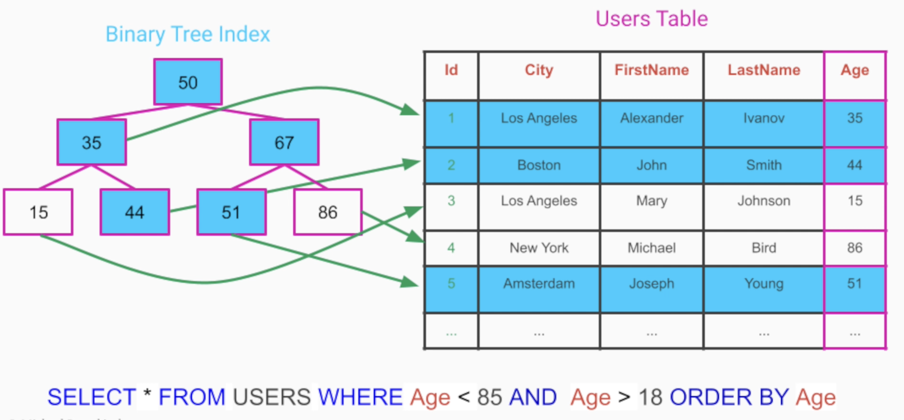

# Indexes

> The Index Table pattern involves creating additional tables in a database that are optimized for specific query operations. These tables act as secondary indexes and are designed to speed up the retrieval of data without requiring a full scan of the primary data store. Index tables are particularly useful in scenarios with large datasets and where certain queries are performed frequently.

- <https://learn.microsoft.com/en-us/azure/architecture/patterns/index-table>
- A `database index` is a helper table, created from a particular column/group of columns
- Reduce the time to make a query to a sublinear time
- Queries no longer have to make a full table scan
- **Tradeoff**
  - Additional space for storing the index tables
  - Slower write operations

## Hash Table Indexes

- `Each value` of the indexed column is hashed and partitioned into separate "buckets"
- The search operation can then scan only the bucket in which the the actual data might be located

- Indexes can also be created out of multiple columns. This is the `composite index`

## Tree Indexes

- `Range of values` can be indexed, the values need to be comparable

