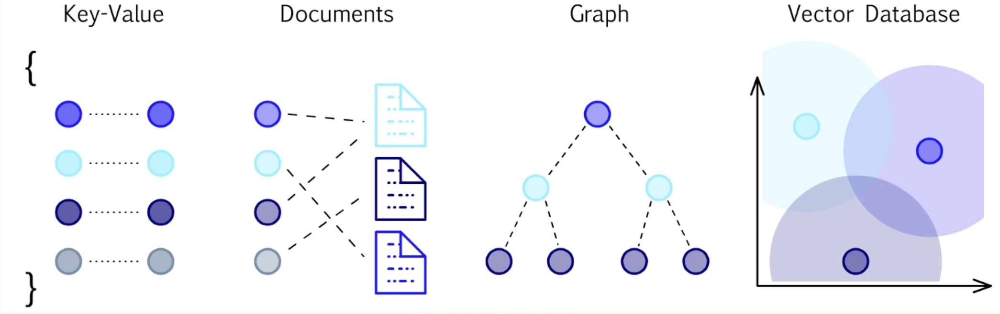

# Database Paradigms

- <https://db-engines.com/en/ranking_trend>
- <https://db-engines.com/en/ranking>

## Relational DB

- Rigid structure enforced by table's `schema`
- Has support for `transactions` (ACID compliant)
- Difficult to scale horizontally (scale-up instead of scale-out)
- Slower read operations on large analytical workloads
- On-line Transaction Processing (OLTP)

- **Implementations**
  - MySQL / MariaDB
  - Postgres (most popular open-source choice in 2026)
  - SQL Server
  - RDS & Aurora (AWS)

## NewSQL / Distributed SQL

- Combines relational guarantees (ACID, SQL) with horizontal scalability
- Designed for geo-distributed deployments
- Handles high write throughput without sacrificing consistency
- Bridges the gap between traditional RDBMS and NoSQL scalability

- **Implementations**
  - CockroachDB
  - TiDB
  - Google Spanner / AlloyDB
  - PlanetScale (MySQL-compatible)
  - Neon (serverless Postgres)

## Key-Value DB

- It's a large scale hash table
- Data commonly stored in RAM (or optionally persisted to disk)
- Perfect use-case for caches, sessions, pub/sub, and counters
- Some implementations now also support vector search and streaming

- **Implementations**
  - Redis / Redis Stack (with vector & search modules)
  - Valkey (open-source Redis fork maintained by Linux Foundation)
  - Memcached
  - Etcd (distributed config & leader election)
  - DragonflyDB (Redis-compatible, high throughput)

## Document Oriented DB

- Each document is a container for key-value pairs (typically JSON/BSON)
- No schema (flexible/schemaless)
- Documents are grouped together in collections
- Good for hierarchical or nested data

- **Implementations**
  - MongoDB
  - Firestore (GCP)
  - DynamoDB (AWS, also key-value hybrid)
  - CouchDB
  - SurrealDB (multi-model with document support)

## Columnar / OLAP DB

- Data is stored column-by-column instead of row-by-row
- Optimized for analytical queries (aggregations, scans) over large datasets
- On-line Analytical Processing (OLAP)
- Often used in data warehousing and business intelligence

- **Implementations**
  - DuckDB (in-process, embeddable — very popular for local analytics)
  - ClickHouse (real-time analytics at scale)
  - Apache Parquet + Iceberg (open table format)
  - Snowflake
  - BigQuery (GCP)
  - Redshift (AWS)
  - Apache Druid (real-time ingestion)

## Wide-Column DB

- Keys store multiple columns (values) organized in column families
- No schema
- Good for time-series data, historical records, high-write, low-read workloads
- Scales horizontally to petabytes

- **Implementations**
  - Cassandra
  - HBase
  - ScyllaDB (Cassandra-compatible, higher throughput)
  - Google Bigtable

## Time-Series DB

- Optimized for sequential, timestamped data points
- Efficient compression and retention policies
- Common in observability, IoT, metrics, and financial tick data
- Supports downsampling and time-based aggregations natively

- **Implementations**
  - InfluxDB
  - TimescaleDB (Postgres extension)
  - Prometheus (metrics, pull-based)
  - VictoriaMetrics (Prometheus-compatible, high cardinality)
  - QuestDB (SQL-based, high ingestion rate)

## Vector DB

- Connects data that is **similar** (semantic proximity in embedding space)
- Stores high-dimensional vector embeddings (from ML models)
- Enables semantic/similarity search via Approximate Nearest Neighbor (ANN)
- Core infrastructure for RAG (Retrieval-Augmented Generation) pipelines and AI applications
- Rapidly growing paradigm since 2023

- **Implementations**
  - `Pinecone`: SaaS, very population for AI apps
  - `Weaviate`: Open-source, graphQL API
  - `Qdrant`: Open-source, Rust-based
  - `Milvus`: Open-source, large-scale
  - `Chroma`: lightweight, local-first, prototyping
  - `Pgvector`:Postgres extension

## Graph DB

- Connects data that is **connected** (explicit relationships between entities)
- Data is represented as `nodes` (vertices) with properties
- Relationships are represented as `edges` (can be directed and weighted)
- Two main models: **Property Graphs** (Neo4j) and **RDF/Triple Stores** (SPARQL)

- **Use cases**
  - Fraud detection in finance
  - Recommendation engines
  - Knowledge graphs
  - Social network analysis

- **Implementations**
  - Neo4j
  - Amazon Neptune
  - DGraph
  - FalkorDB (Redis-based, fast property graph)
  - Kuzu (embeddable, DuckDB-style for graphs)

## Search DB

- Analyze and index text content for full-text search
- Support relevance ranking, faceting, typo-tolerance
- Good for search bars, e-commerce product search, log search

- **Implementations**
  - Elasticsearch / OpenSearch
  - Apache Solr (built on Lucene)
  - Algolia (managed SaaS)
  - MeiliSearch (open-source, easy to self-host)
  - Typesense (open-source, fast)
