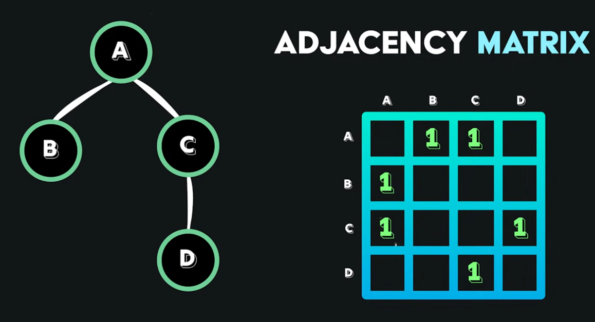
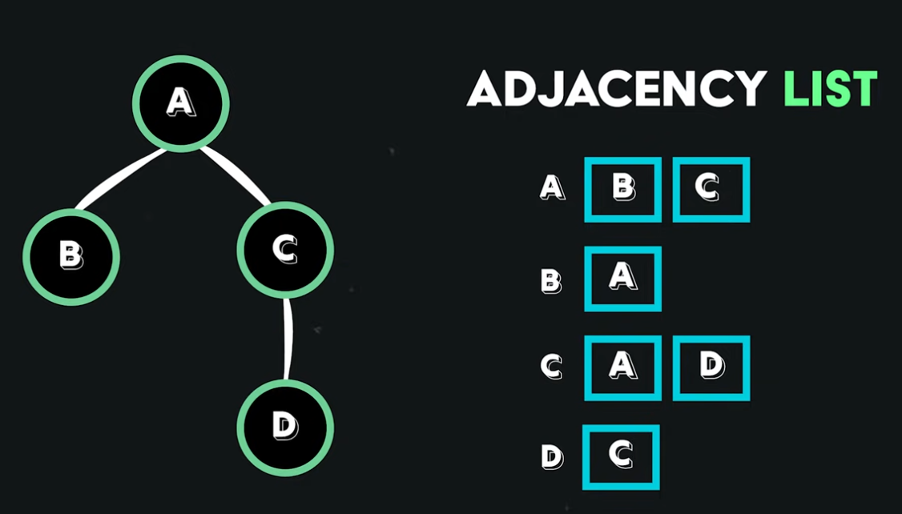

# Graph DB

- Data is represented as `nodes` (circles)
- Relationships are represented as `edges` (arrows)
  - Can be weighted
  - Can be unidirectional or bidirectional

## Use cases

- Recommendation systems

## Graph Representation

- `Adjacency Matrix`: Quadratic time to insert a new node
  

- `Adjacency List`: Each item has its own array of neighbors
  

## Traverse

- `DFS`: depth-first search
- `BFS`: breadth-first search
