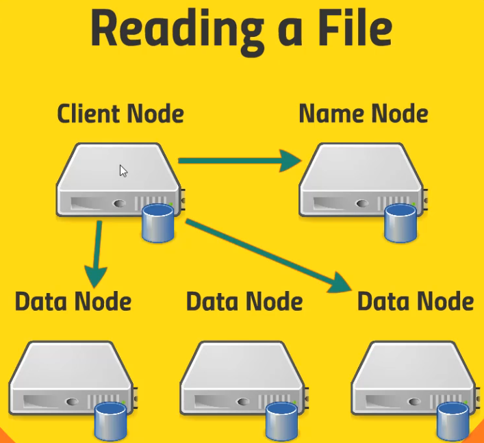
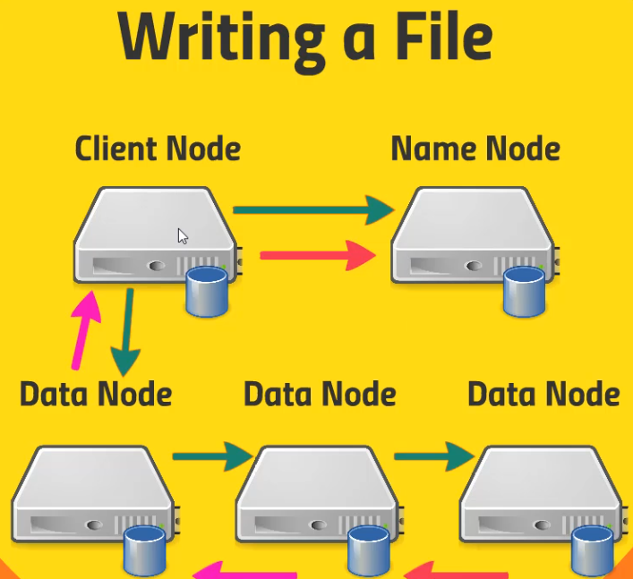

# Hadoop Distributed File System (HDFS)

- Handles big files
- Break files into blocks (128mb chunks)
- Stores in a cluster of hard drivers

## Name Node

- Keeps track about the blocks and in which data node they live
- Maintains the `edit log` and logs all the read/write operations
- Namenode resiliency
  - Option 1: backup the metadata both to local disk and a NFS
  - Option 2: runs a secondary namenode that maintains a merged copy of the edit log
  - Option 3: HDFS Federation - each namenode manages a specific namespace volume
  - Option 4: HDFS High Availability - hot standby namenod using a shared edit log. With zookeeper tracking the active namenodes. Must ensure that only one namenode is used at a time!

## Data Node

- Where the chunks of data are actually stored
- Data Nodes talk to each other to replicate the chunks of data

## Read/Write Flows

- `Reading`
  1. Name Node tells the client where the data lives
  1. Client go and fetch the data directly from the data nodes

- `Writing`
  1. Client tells the Name Node that it's gonna write a file
  1. Client sends data to a single Data Node
  1. Data Node replicates the data across the other data nodes
  1. Data Node acks the client if OK
  1. Client acks the Name Node

## HDFS Interfaces

- UI (Ambari Files View)
- Command-line interface
- HTTP/HDFS proxy
- Java interface
- NFS Gateway
