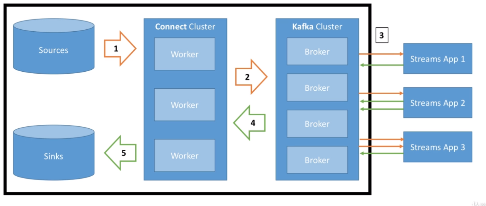

# Kafka Connect

- Kafka `Connector Source`: move external data into kafka
- Kafka `Connector Sink`: move kafka data into external base
- <https://www.confluent.io/product/connectors/>



- Kafka Connect is the cluster that connects to Kafka (either to source or sink)
- Kafka Connectors are the plugins for Kafka Connect, which uses the Kafka Connect API

```shell
# Run a Kafka Connect Cluster
connect-standalone.sh -daemon "connect-standalone.properties"
```
