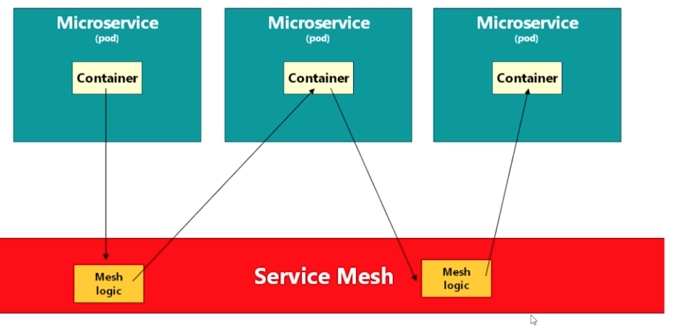
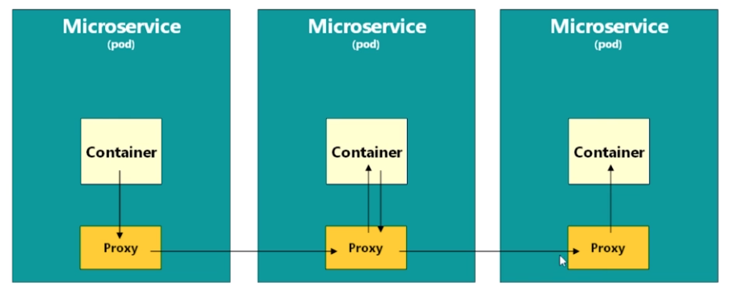

# Istio

- Istio is a `Service Mesh`
  - A way of `managing communication` between microservices
  - Istio uses `CustomResourceDefinitions` (CRD), extending the K8S API

## Challenges of Microservice Architecture

- `Kubernetes`
  - The most successful framework for building distributed architectures
  - Orchestration framework
  - K8S alone is not good at the connection between the pods (with service concepts)
  - K8S alone doesn't give visibility of control over the connections
- For each microservice the following aspects must be incorporated
  - `Business Logic`
  - `Communication configurations`
  - `Security logic`
  - `Retry logic`
  - `Metrics & Tracing logic` (telemetry)
- This adds complexity to the services instead of keeping them simple and lightweight
- The solution? `Service Mesh`! A sidecar proxy keep all the non-business logic



## Istio Service Mesh

- A service mesh is a layer of software and sits underneath the pods
  - `Service Mesh` is the `network layer` that consists of the `Control plane` + `Proxies`
- All the networking is routed through the service mesh software
- Telemetry functions (Like Prometheus and Grafana). Tracing. Security. Traffic management
- A `Control Plane` automatically inject a `sidecar proxy` to each POD
  - The MS now talk to each other through those proxies



## Istio CRDs

- There are two main CRDs in Istio
  - `VirtualServices`
  - `DestinationRules`

```sh
# Virtual services
kubectl get virtualservice
kubectl get vs

# Destination rules
kubectl get destinationrules
kubectl get dr
```

- VS ad DR can be deleted on `Delete all traffic routing`

## Deploy istio manually

```sh
# Minikube setup
minikube start --memory 4g

# Istio namespace (istio-system) and CRDs
kubectl apply -f 1.istio-crds.yaml

# Build istio control plane
kubectl apply -f 2.istio-install.yaml

# Setup username and password for Kiali
kubectl apply -f 3.kiali-secret.yaml

# Configure istio to inject proxy container into pods in 'default' namespace
kubectl label namespace default istio-injection=enabled # If there are already running pods in the ns they must be restarted
```

- Namespace `istio-system`

  - Pod `istiod`: Istio daemon
  - Pod `ingressgateway`: Control traffic in the cluster (it's a proxy)
  - Pod `egressgateway`: Control traffic out of the cluster
  - Pod `grafana`: graphs and telemetry
  - Pod `jaeger`: Tracing
  - Pod `kiali`: Graphical interface to visualize the cluster and the connections
  - Pod `prometheus`: Monitoring features
