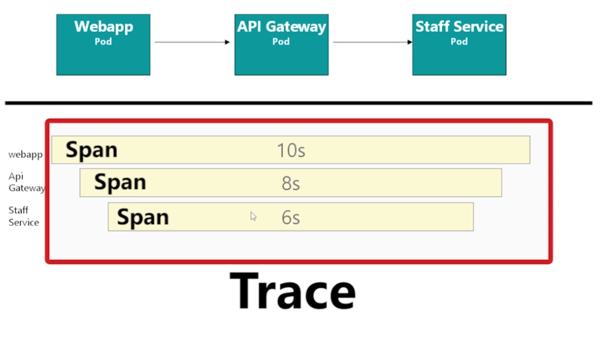

# Telemetry

- Requirements for telemetry
  - Envoy sidecars (proxy)
  - Control plane running
  - No Istio configuration is needed (VS, DR, GW)

## Kiali

- **App graph**: Squares represent a component with label `app`
- **Versioned app graph**: App graph but subdivided into more labels, for example label `version`
- **Service graph**: Connection between services
- **Workload graph**: Workloads are analog to a deployment

## Jaeger

- Distributed tracing framework (implements `OpenTracing`)
- Track a single request
- It runs at the proxy level. Istio has native support for `Jaeger` and `Zipckin`

- **Trace**: Gather of all hoops performed by a request. It's broken down into spans
- **Span**: Each individual route

### x-request-id

- Must be implemented into the code for the `distributed tracing` to work properly
- `x` is HTML standards was used to point out a experimental header. `Extra headers`

- Store the `x-request-id` from request received in a variable
- Send back the `x-request-id` in the header to outgoing requests
