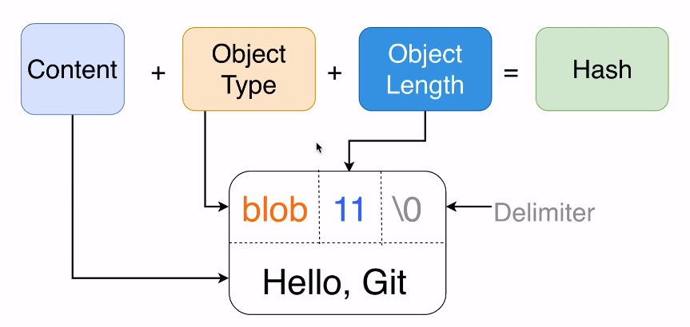

# Git Objects

- Git object are stored in compressed binary format and cannot be read directly (E.g., cat command)

- Git object hash generation
  - The git object is the `object type` + `empty space` + `object length` + `delimiter` + `content`
  - The hash is generated based on the input fo the whole object

## Objects types

- **Blob**
  - Stores any file of any type
  - Store the raw content but no filename or structure
- **Tree**
  - Information about files
  - Create pointers to other objects
- **Commit**
  - Info about author, name, email, description and parent
  - Allow storing different versions of the project
  - It has a pointer to a specific tree in the database. It's a `wrapper` around tree object
  - Moving to different commits is the same as `checking out`
  - To create a new commit, there must be change in the staging area
- **Annotated Tag**
  - Text pointer to a specific commit

## Object permissions

- `040000`: Directory
- `100644`: Regular non-executable file
- `100664`: Regular non-excutable group-writeable file
- `100755`: Regular executable file
- `120000`: Symbolic link
- `160000`: Gitlink
