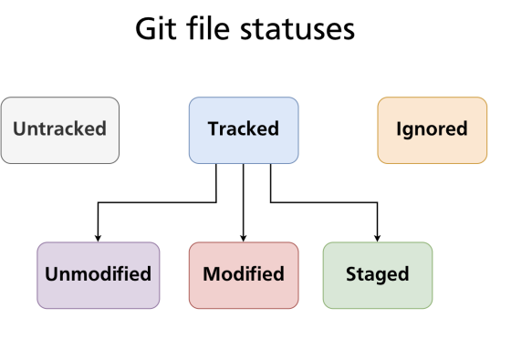

# Git areas

- There are 3 areas

1. `Working directory`: The files the appear in the folder to the user
   - `ls`
1. `Staging area (index)`: Prepare file to be inserted/extracted to/from git repo
   - `git ls-files`
1. `Git repository`: Where the git objects live
   - `find .git/objects -type f`

## File tracking statuses

1. `Untracked`
   - New files added to working dir
1. `Modified`
   - Committed file, but there is a newer version
1. `Deleted`
   - Committed file, but it has been removed from working directory
1. `Staged`
   - When a file (untracked or modified) is added to staging area
1. `Unmodified`
   - Committed file, and there is no newer version. These files are not shown in git status

- A tracked file (modified, staged or unmodified) can also be untracked again

