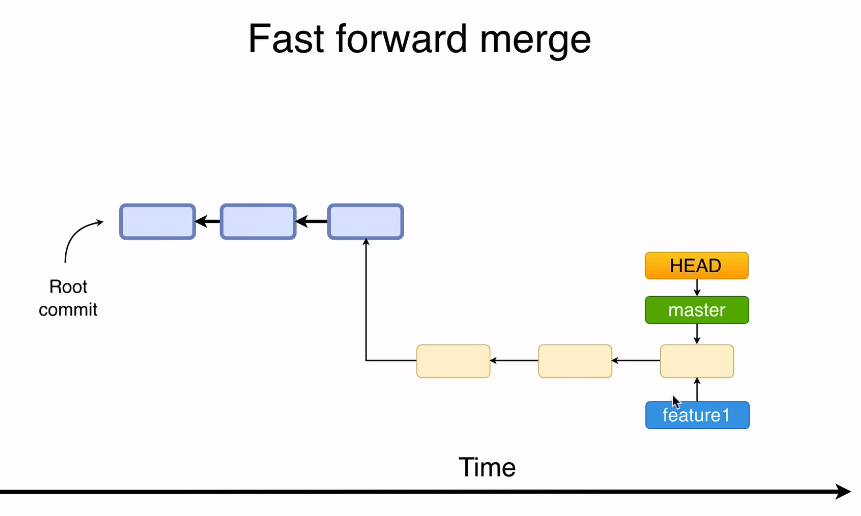
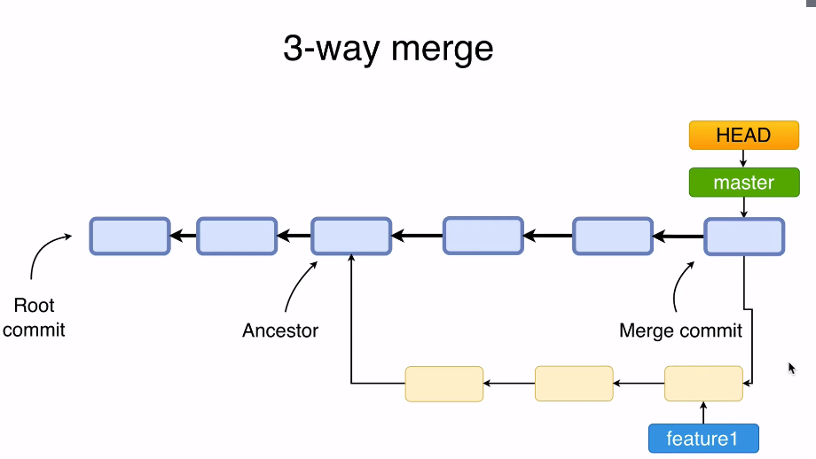

# Git merge

## Merge policies

### Fast-forward merge

- It is only possible when there are `no further commits` in the receiving branch after the branch creation
- There is `no merge conflict` in FF
- First checkout to the `master` and then merge `feature` branch
- Git simply takes the master branch pointer and moves it to the last commit in feature branch!
- After merging the branch can be safely removed `git branch -d branch-name`



### 3-way merge

- A new `merge commit` in master is created. The new merge commit `incorporates all the changes` of the secondary branch
- `Conflicts` may appear!
- This new commit has `2 parents`: one from master, one from feature branch
- The feature branch is incorporated to the master branch, all its structure now lives in the master branch
- All the commits in feature branch is incorporated as a single commit in master



## Merge conflicts

- Merge conflicts occur when `same files were edited` in both branches
- Conflicts must be `resolved on the merge commit`
- When a merge has failed due to conflict, the following message is shown

```txt
Auto-merging file7.txt
CONFLICT (content): Merge conflict in file7.txt
Automatic merge failed; fix conflicts and then commit the result.
```

- That means the `merge commit` has not yet been created and it's WIP until you manually fix and commit it
- Conflict resolution pattern

```txt
<<<<<<< HEAD
Line replaced in master branch
=======
Line replaced in BR-3 branch+
>>>>>>> BR-3
```

- Merge conflicts are identified between the conflicting files appear 3 times in `git ls-files -s`

  - `0` (no conflict): file is the same in the repository
  - `1`: file version that is common for both branches - ancestor commit
  - `2`: last file version from master branch <<<<<<< HEAD
  - `3`: last file version from feature branch >>>>>>> feature
  - As soon as the conflict is solved the file changes to 0

- After fixing the conflicts, `git commit` (a edit for message will open)
  - `.git/MERGE_HEAD` is the pointer for last commit of feature branch.
  - `.git/HEAD` is the pointer of last commit in master branch (that is merging)
  - Both of them will be parents in the new merge commit
