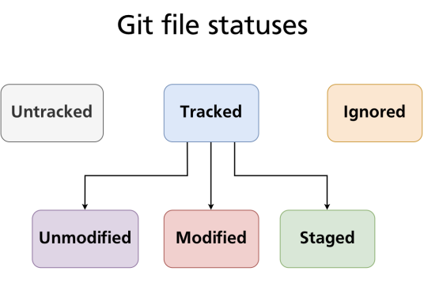

# Git ignore

- Explicitly tells git which files and folders to ignore
- Rules are defined in `.gitignore`

## Commit previously ignored files

- Simply remove it from gitignore and commit it again

## Ignore previously committed file

- Option 1
  1. Add ignore rule to .gitignore
  1. Delete file from WIP
  1. Commit changes
  1. Add again previously deleted file
- Option 2
  1. Add ignore rule to .gitignore
  1. Delete file only from repo keeping it in WIP `git rm --cached filename`

## Best practices for git ignore

- Build folders (bin, dist, etc)
- Dependency folders (node_modules)
- Compiled and log files (\*.pyc, \*.log)
- Hidden OS files (Thumbs.db, .DB_Store)

- <https://gitignore.io>
- <https://github.com/github/gitignore>
