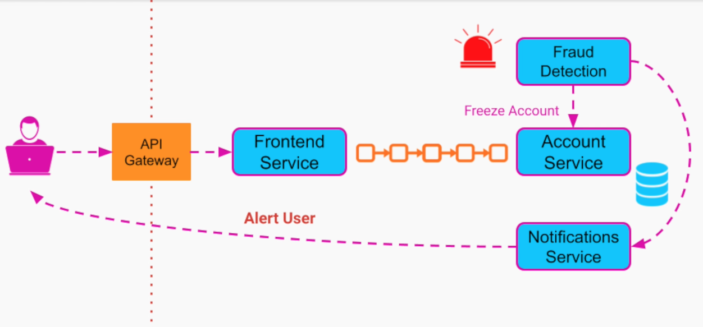

# Event Driven Architecture

- Communications between services by means of `events`

> An event is an immutable statement of a fact or a change

- Communication is performed via an `event broker`

## Events

- **Fact**
  - User clicking on a digital ad
  - Item being added to a shopping cart

- **State Change**
  - Play button of a video game
  - IoT device position change (vacuum cleaner)

## Actors

- **Event Producer** (emitter)
- **Event Consumer**
