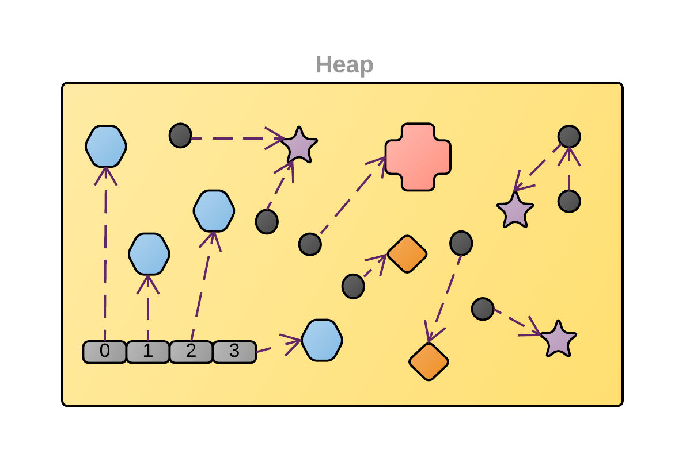

# Heap

- It's a `dynamic allocation` of memory
- Heap is reserved to variables and data created upon executing the program (`runtime`)
- C heap functions
  - `malloc()`
  - `calloc()`
  - `realloc()`
  - `free()`

