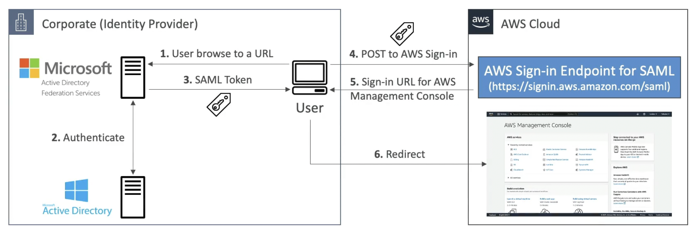

# ADFS (AD Federation Services)

> It's being deprecated in favor of Entra ID

- It's Microsoft's `Identity Provider` (IdP)
- Provides Single Sign-On across applications (e.g., Office 365,)
- SAML 2.0 compatible

