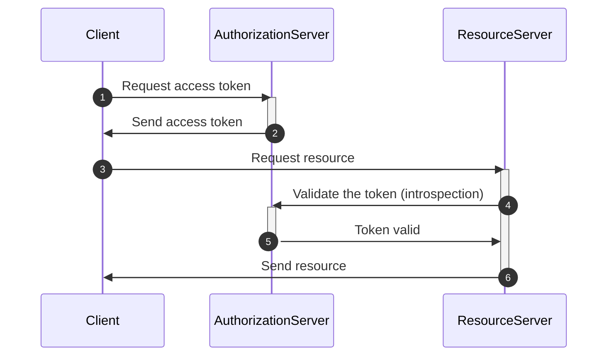

# Sequence Diagram

```mermaid
sequenceDiagram
  autonumber

  participant Client
  participant AuthorizationServer
  participant ResourceServer

  Client->>AuthorizationServer: Request access token
  activate AuthorizationServer

  AuthorizationServer->>Client: Send access token
  deactivate AuthorizationServer

  Client->>ResourceServer: Request resource
  activate ResourceServer

  ResourceServer->>AuthorizationServer: Validate the token (introspection)
  activate AuthorizationServer

  AuthorizationServer->>ResourceServer: Token valid
  deactivate AuthorizationServer

  ResourceServer->>Client: Send resource
  deactivate ResourceServer
```
