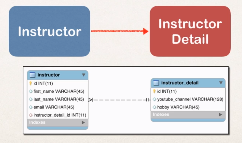
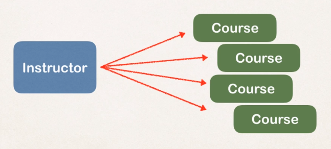
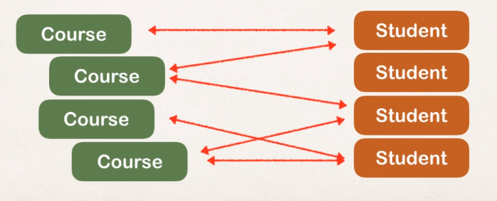
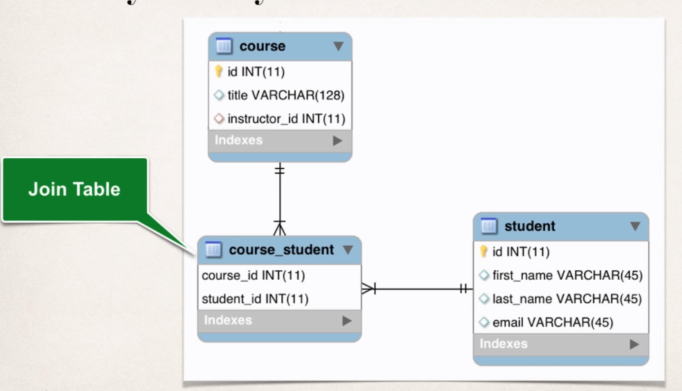
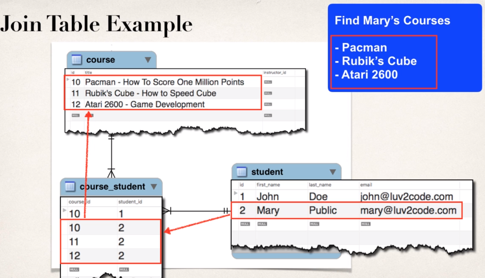
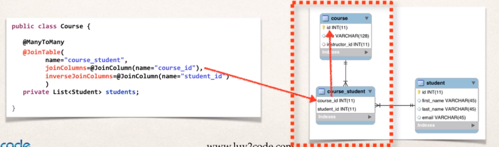
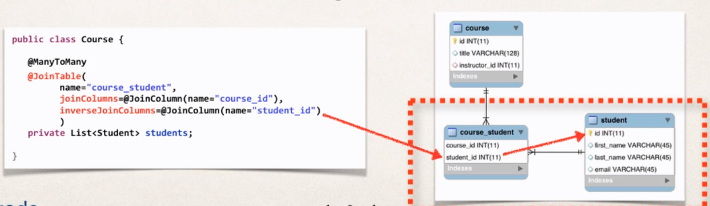

# Mappings

- **One-to-One**

- E.g., a instructor has its details in a separate table
  
- Use `@OneToOne` and `@JoinColumn(name = fk_field)`
- Use `@OneToOne(mappedBy=instructorDetail)` for a bidirectional (when the first unidirectional reference has already been made). This uses the instructorDetail property of Instructor class and use its information of @JoinColumn

- **One-to-Many** (Many-to-One)

- E.g., a instructor can have multiple courses
- One-to-Many relationships can be unidirectional or bidirectional
  
- Do not use cascade delete if the reference is bidirectional

- **Many-to-Many**

- E.g., a course can have many students, students can have many courses
  
- Never use cascade delete on many to many relationships

## Cascade Types

- `Cascade` is the action of applying the same operation to related entities
- Cascading finds the related table by the `primary key` and `foreign key`
- By default, no operations are cascaded

- **Cascade Types**
  - `Persist`: if entity is saved, related entity will also be saved
  - `Remove`: if entity is removed, related entity will also be removed
  - `Refresh`: if entity is refreshed, related entity will also be refreshed
  - `Detach`: if entity is detached, related entity will also be detached
  - `Merge`: if entity is merged, related entity will also be merged
  - `All`: all of the above cascade types

```java
@Entity
@Table(name="instructor")
public class Instructor {
    @OneToOne(cascade = CascadeType.All) // cascade all operations to the relatedentities
    //@OneToOne(cascade = {CascadeType.DETACH, CascadeType.MERGE}) // list of cascade types
    @JoinColumn(name = "instructor_detail_id") // primary key
    private InstructorDetail instructorDetail;
}
```

## Data fetch

- **Eager**: retrieve everything from all related tables in one shot
- **Lazy**: retrieve the data from the related tables only when requested (on demand). Preferred!
  - `@OneToMany(mappedby = "instructor", fetch = FetchType.LAZY)`
  - To retrieve data at a latter time, the hibernate session must be opened (otherwise it throws an exception - LazyInitializationException).

| Mapping    | Default Fetch Type |
| ---------- | ------------------ |
| @OneToOne  | FetchType.EAGER    |
| @OneToMany | FetchType.LAZY     |
| @ManyToOne | FetchType.EAGER    |
| @ManyToOne | FetchType.LAZY     |

## Join Table

- `Join Table` is a table that provides a mapping between 2 tables in a `Many To Many` relationship
- It has a `foreign key` for each of both tables.
- The foreign keys are also the primary key of the join table
- `@JoinTable` is used for Many to Many relationships




- Join Column
  
- Inverse Join Column Inverse
  
