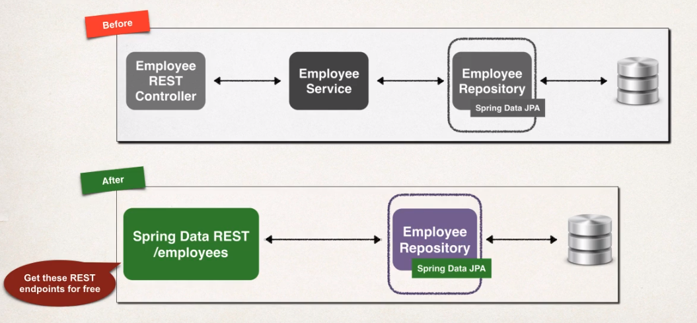

# Spring Boot

- Make it easy to start a Spring project
- Minimize the amount of manual configuration
- Provides an `embedded HTTP server` (tomcat, jetty, undertow, ...)
  - But you can also deploy the `war file` to an external server
- `Spring Initializr` creates a spring project boilerplate
  - <https://start.spring.io/>
  - `jar`: do not use src/main/webapp folder
  - `war`: use src/main/webapp

## Project Structure

- `src/main/java`: source code
- `src/main/resources`: properties and config files
- `src/test/java`: unit tests

- Maven Wrapper Files
  - `mvnw` & `mvnw.cmd`
    - script to run maven commands with no need to have maven installed.
    - E.g., `./mvnw clean compile test`
    - These files can be safely removed

## Starter Parent

- Special starter that provides Maven defaults

```xml
<parent>
  <groupId>org.springframework.boot</groupId>
  <artifactId>spring-boot-starter-parent</artifactId>
  <version>2.5.3</version>
  <relativePath/> <!-- lookup parent from repository -->
</parent>
```

- There's no need to list the `spring-boot-starter` versions
- They are all inherited by the `spring-boot-starter-parent` version
- Ensures that all versions are compatible

## Dependencies (Starters)

- **spring-boot-starter-web**
  - spring-web
  - spring-webmvc
  - spring-boot-starter
  - spring-boot-starter-tomcat
  - spring-boot-starter-json

```xml
<dependency>
  <groupId>org.springframework.boot</groupId>
  <artifactId>spring-boot-starter-web</artifactId>
</dependency>
```

- **spring-boot-starter-security**: security support and login forms

```xml
<dependency>
  <groupId>org.springframework.boot</groupId>
  <artifactId>spring-boot-starter-security</artifactId>
</dependency>
```

- **spring-boot-devtools**: Automatically restarts the app on code change

```xml
<dependency>
  <groupId>org.springframework.boot</groupId>
  <artifactId>spring-boot-devtools</artifactId>
  <scope>runtime</scope>
</dependency>
```

- **spring-boot-starter-actuator**
  - Exposes endpoints to `monitor` and `manager` your application
  - Rest endpoints are automatically added to the app
  - `/actuator/health`, `/actuator/info`, `/actuator/auditevents`, `/actuator/beans`, `/actuator/mappings`

```xml
<dependency>
  <groupId>org.springframework.boot</groupId>
  <artifactId>spring-boot-starter-actuator</artifactId>
</dependency>
```

- **spring-boot-starter-data-jpa**:
  - JPA (Java Persistence API) and hibernate
  - JPA is an standard API for ORM (a set of interfaces)
  - Hibernate implements the JPA interfaces
  - Hibernate is the default implementation of JPA on Spring Boot
  - `EntityManager` is a wrapper on the hibernate session (wraps the SessionFactory)

```xml
<dependency>
  <groupId>org.springframework.boot</groupId>
  <artifactId>spring-boot-starter-data-jpa</artifactId>
</dependency>
```

- **spring-boot-starter-data-rest**
  - Generate REST API automatically from an Entity

```xml
<dependency>
  <groupId>org.springframework.boot</groupId>
  <artifactId>spring-boot-starter-data-rest</artifactId>
</dependency>
```

- **spring-boot-starter-thymeleaf**

```xml
<dependency>
  <groupId>org.springframework.boot</groupId>
  <artifactId>spring-boot-starter-thymeleaf</artifactId>
</dependency>
```

## Maven Plugin

```xml
<build>
  <plugins>
    <plugin>
      <groupId>org.springframework.boot</groupId>
      <artifactId>spring-boot-maven-plugin</artifactId>

      <!-- Container image build configuration -->
      <configuration>
        <image>
          <name>hvitoi/ms-${project.artifactId}:${project.version}</name>
        </image>
        <pullPolicy>IF_NOT_PRESENT</pullPolicy>
      </configuration>

    </plugin>
  </plugins>
</build>
```

```shell
# Build (generate jar)
mvn package

# Run app
java -jar "demo-0.0.1-SNAPSHOT.jar"
mvn spring-boot:run

# Build container image for the app
mvn spring-boot:build-image
```

## Application

- `@SpringBootApplication`
  - @EnableAutoConfiguration: auto-configuration support
  - @ComponentScan: scan components to register beans
  - @Configuration: register extra beans
- `SpringApplication.run(DemoApplication.class, args)`
  - Creates the application context and register all beans
  - Starts the embedded server
- Place your `Application.java` in the root package
  - Implicitly defines the base search package (component scanning)
  - You can also explicitly base package with `scanBasePackages` parameter

```java
@SpringBootApplication(scanBasePackages={"com.hvitoi.demo", "org.acme.iot.utils"})
public class DemoApplication {

  public static void main(String[] args) {
    SpringApplication.run(DemoApplication.class, args);
  }

}

```

## Properties

- <https://docs.spring.io/spring-boot/docs/current/reference/html/application-properties.html#application-properties>
  - Core
  - Web
  - Security: login form and user management
  - Data: data source, entity manager
  - Actuator
  - Integration
  - DevTools
  - Testing
- **src/main/resources/application.properties**: all spring config

```properties
server.port=8585
coach.name=Mickey Mouse
team.name=The Mouse Crew
```

```java
@RestController
public class FunRestController {
  @Value("${coach.name}")
  private String coachName

  @Value("${team.name}")
  private String teamName
}
```

- **src/main/resources/static**: html, css, js, images, etc

## Spring Data JPA

- Generate `DAO API` from an `Entity` and `Primary Key`
- Expose methods to manipulate database information automatically

```java
package com.hvitoi.demo.dao;

import org.springframework.data.jpa.repository.JpaRepository;
import com.hvitoi.demo.entity.Employee;

public interface EmployeeRepository extends JpaRepository<Employee, Integer> {
}
```

- Expose many methods such as
  - findAll
  - findById
  - save
  - deleteById

## Spring Data Rest

- Generate a `REST API` from a `Repository`
- Expose REST endpoints for entities automatically
- Simply add the dependency

```xml
<dependency>
  <groupId>org.springframework.boot</groupId>
  <artifactId>spring-boot-starter-data-rest</artifactId>
</dependency>
```



- Spring Data REST endpoints are `HATEOAS` compliant

  - `Hypermedia as the Engine of Application State` (HATEOS)
  - Hypermedia-driven sites provide information to access REST interfaces (Metadata of REST data)
  - HATEOS uses `Hypertext Application Language` (HAL) data format (format of the json)
  - Offer `pagination`, `sorting`, `searching`, etc
  - Offer `Query Domain Specific Language` (Query DSL)

- @RepositoryRestResource(path = "employees"): modifies the path (case the word has a complex plural)

```java
@RepositoryRestResource(path = "employees") // if not specified "employee + s" will be used
public interface EmployeeRepository extends JpaRepository<Employee, Integer> {
  // Give "Entity Type" and "Primary Key" and receive a funcional DAO
  // There is no implementation, just the interface
}

```

- Example: `GET /employees`
  - For collections, medata includes page size, total elements, pages, etc

```json
{
  "_embedded": {
    "employees": [
      {
        "firstName": "Leslie",
        "lastName": "Andrews",
        "email": "leslie@luv2code.com",
        "_links": {
          "self": {
            "href": "http://localhost:8080/magic-api/employees/1"
          },
          "employee": {
            "href": "http://localhost:8080/magic-api/employees/1"
          }
        }
      },
      {
        "firstName": "Emma",
        "lastName": "Baumgarten",
        "email": "emma@luv2code.com",
        "_links": {
          "self": {
            "href": "http://localhost:8080/magic-api/employees/2"
          },
          "employee": {
            "href": "http://localhost:8080/magic-api/employees/2"
          }
        }
      }
    ]
  },
  "_links": {
    "self": {
      "href": "http://localhost:8080/magic-api/employees"
    },
    "profile": {
      "href": "http://localhost:8080/magic-api/profile/employees"
    }
  },
  "page": {
    "size": 20,
    "totalElements": 2,
    "totalPages": 1,
    "number": 0
  }
}
```

- Example: `GET /employees/1`

```json
{
  "firstName": "Leslie",
  "lastName": "Andrews",
  "email": "leslie@luv2code.com",
  "_links": {
    "self": {
      "href": "http://localhost:8080/magic-api/employees/1"
    },
    "employee": {
      "href": "http://localhost:8080/magic-api/employees/1"
    }
  }
}
```

- Other queries
  - `/employees?page=1`
  - `/employees?page=1`
  - `/employees?sort=lastName`
  - `/employees?sort=lastName,desc`
  - `/employees?sort=lastName,firstName,asc`
