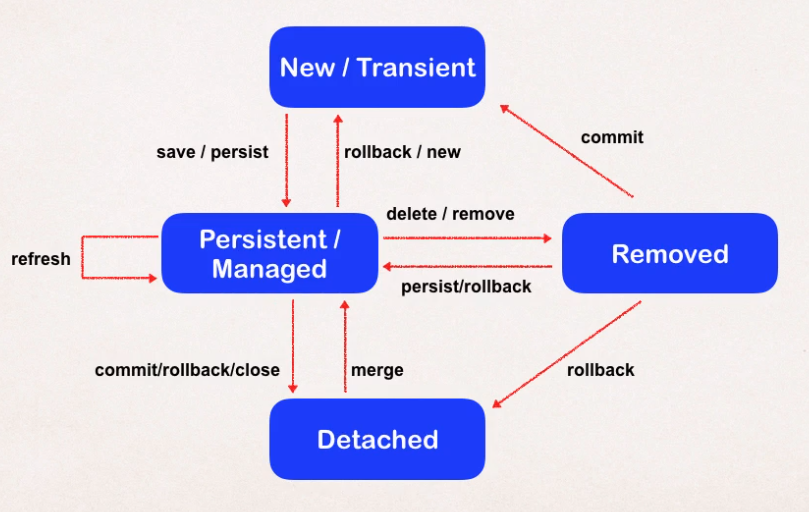

# Hibernate

- Framework for `persisting java objects to a database`
- Handles all the low level `SQL`
- Minimize the amount of `JDBC` code
  - Hibernate uses JDBC for all db communications. Abstract this code from the developer
- Provides `Object-to-Relational Mapping` (`ORM`)
- Hibernate is built on top of Java Persistence API (`JPA`), which is a standard specification for ORM
  - Hibernate implements all of JPA annotations

## MySQL DB

```shell
# MySQL
docker container run \
  -p 3306:3306 \
  --name meusql \
  --env MYSQL_ROOT_PASSWORD=123 \
  --detach \
  mysql:8.0

docker container cp 01-create-user.sql meusql:/tmp
docker container cp 02-student-tracker.sql meusql:/tmp
docker container exec -it meusql bash
mysql -u root -p123 < /tmp/01-create-user.sql
mysql -u root -p123 < /tmp/02-student-tracker.sql
```

- Url for connection <jdbc:mysql://localhost:3306/hb_student_tracker?useSSL=false&amp;serverTimezone=UTC
- SSL must be set to false

## Dependencies

```xml
<dependencies>
  <!-- https://mvnrepository.com/artifact/mysql/mysql-connector-java -->
  <dependency>
    <groupId>mysql</groupId>
    <artifactId>mysql-connector-java</artifactId>
    <version>8.0.22</version>
  </dependency>

  <!-- https://mvnrepository.com/artifact/org.hibernate/hibernate-core -->
  <dependency>
    <groupId>org.hibernate</groupId>
    <artifactId>hibernate-core</artifactId>
    <version>5.4.27.Final</version>
  </dependency>
</dependencies>
```

## Hibernate configuration

- `hibernate.cfg.xml`
- For Maven projects, it should be placed under `/src/main/resources`

```xml
<!DOCTYPE hibernate-configuration PUBLIC "-//Hibernate/Hibernate Configuration DTD 3.0//EN" "http://www.hibernate.org/dtd/hibernate-configuration-3.0.dtd">

<hibernate-configuration>

    <session-factory>

        <!-- JDBC Database connection settings -->
        <property name="connection.driver_class">com.mysql.jdbc.Driver</property>
        <property name="connection.url">jdbc:mysql://localhost:3306/hb_student_tracker?useSSL=false&amp;serverTimezone=UTC</property>
        <property name="connection.username">root</property>
        <property name="connection.password">123</property>

        <!-- JDBC connection pool settings ... using built-in test pool -->
        <property name="connection.pool_size">1</property>

        <!-- Select our SQL dialect -->
        <property name="dialect">org.hibernate.dialect.MySQLDialect</property>

        <!-- Echo the SQL to stdout -->
        <property name="show_sql">true</property>

        <!-- Set the current session context -->
        <property name="current_session_context_class">thread</property>

    </session-factory>


</hibernate-configuration>
```

## Entity lifecycle

- The session factory reads the hibernate config file and create `session objects`
- The session objects are created once in your app
- The `session` wraps a JDBC connection. Short lived object

- **Entity lifecycle**
  - `Detach`: entity is not associated with a hibernate session
  - `Merge`: reattach an entity to the session
  - `Persist`: transition new instance to a managed state (next flush/commit will save to db)
  - `Remove`: remove managed entity. (next flush/commit will delete from db)
  - `Refresh`: reload/sync object with data from db. Prevents stale data (data in memory different from data in db)



## Entity class

- It's a java class (POJO) that is mapped to a database table
- 2 options for mapping a class
  - XML config (legacy)
  - Java annotations (modern)

```java
@Entity
@Table(name="student")
public class Student {
    @Id // Primary key
    @Column(name="id")
    private int id;

    @Column(name="first_name")
    private String firstName;

    @Column(name="last_name")
    private String lastName;

    @Column(name="email")
    private String email;
}
```

## Primary keys

```java
@Id // Primary key
@GeneratedValue(strategy = GenerationType.IDENTITY)
@Column(name="id")
private int id;
```

- ID generation strategies
  - `Generation.Type.AUTO`: Pick strategy for a particular database
  - `Generation.Type.IDENTITY`: Assign primary keys using database identity column. `Auto increment`
  - `Generation.Type.SEQUENCE`: Assign primary keys using database sequence
  - `Generation.Type.TABLE`: Assign primary keys using underlying database table
  - `Custom strategy`: Override the method `public Serializable generate(...)` with implementation from `org.hibernate.id.IdentifierGenerator`
