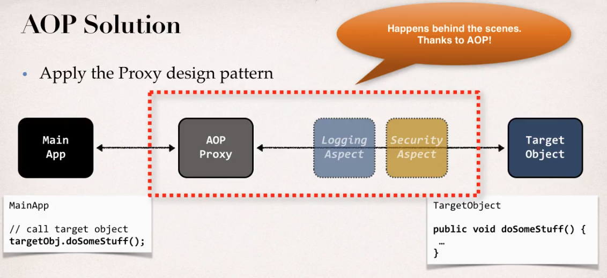

# Aspect-Oriented Programming

- Programming technique based on concept of an `Aspect`
- Aspect encapsulates `cross-cutting concern` (logic/functionality)
  - That means functionalities that many classes will need!
- An Aspect can be `reused` at multiple locations just changing a configuration

- **Benefits**
  - `Reusable modules`: promotes code reuse and easier to change
  - `Resolve code tangling`
  - `Resolve code scatter`: code for an Aspect is defined in a single class
  - `Cleaner code`: business code is cleaner (only write code to business functionality)
  - Applied selectively based on configuration

## Terminology

- **Aspect**: module of code for cross-cutting concern (logging, security, ...)
  - It's annotated with `@Aspect` and `@Component`
  - Aspects can be ordered with `@Order` annotation. Order can have negative numbers
- **Advice**: it's the chunk of code to be executed and when it should be applied
  - `@Before`: run before the method. `@Before`
  - `@After` / `@AfterFinally`: run after the method (always). Runs after @AfterReturning or @AfterThrowing
  - `@AfterReturning`: run after the method (success case)
  - `@AfterThrowing`: run after the method (fail case)
  - `@Around`: run before and after the method. @Before + @After
- **Join Point**
  - It's a point during the execution of a program
  - It represents a method execution
- **Pointcut**
  - The predicate expression for where advice should be applied
  - Uses the `pointcut expression` language
  - Has various patterns
    - _modifiers-pattern_: public, private, etc
    - _return-type-pattern_: void, boolean, string, etc
    - _declaring-type-pattern_: class name
    - _method-name-pattern_: method name
    - _param-pattern_: param types to match
    - _throws-pattern_: exception types to match
  - E.g.
    - `execution(public void com.hvitoi.AcountDAO.addAccount())`: specific class and method
    - `execution(public void com.hvitoi.*.addAccount())`: class with wildcard and method
    - `execution(public void com.hvitoi.*.*())`: class and method with wildcard
    - `execution(public void add*())`: method with wildcard
    - `execution(public void addAccount())`: no args
    - `execution(public void addAccount(*))`: one arg with any type
    - `execution(public void addAccount(..))`: any number of args with any type
    - `execution(public void addAccount(com.hvitoi.Account))`: one arg with a specific type
    - `execution(public void addAccount(com.hvitoi.Account, boolean))`: two args with specific type
    - `execution(public void addAccount(com.hvitoi.Account, ..))`: one or more args (the first arg is defined)
    - `execution(public * addAccount())`: any return type
    - `execution(* addAccount())`: modifier is any (blank), return type is any (\*)
- **Weaving**: connecting aspects to target objects to create an advised object
  - _Compile-time_
  - _Load-time_
  - _Run-time_: slowest

## Proxy Design Pattern

## Use Cases

- Common applications
  - `Logging`
  - `Security`
  - `Transactions`: @Transactional is an Aspects
- Audit logging
  - who, what, when, where
- Expection handling
  - Log exception and notify DevOps team via SMS/email
- API Management
  - How many times has a method been called user
  - Analytics: what are peak time? what is average load? who is top user?

## AOP Frameworks

- `AspectJ`: original AOP framework (<www.eclipse.org/aspectj>)
  - Supports all join points
  - Works with any POJO
  - Pointcut syntax can become complex
- `Spring AOP`:
  - Simpler
  - Proxy pattern
  - Migrate to AspectJ with @Aspect annotation
  - Run-time weaving only
  - Method-level join points only
  - Apply aspects to beans created by Spring app context only

## Example AOP

- `@Transactional`: begins and commits transaction
- `@ControllerAdvice`: exception handling
